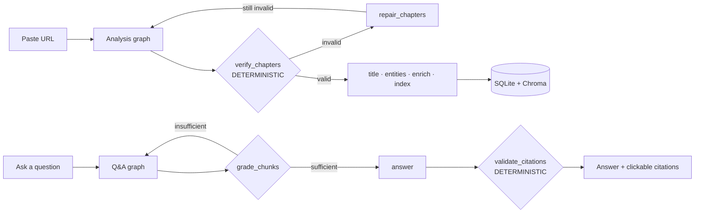
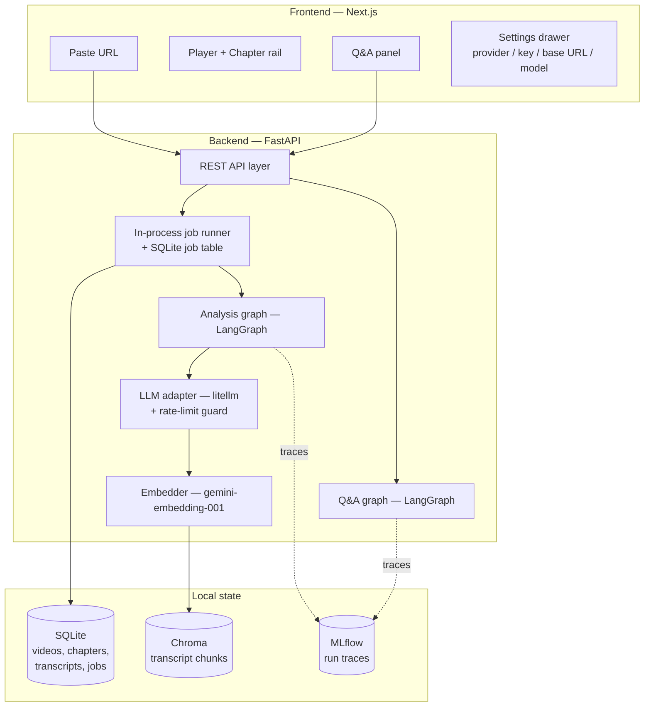

# VideoMind

**Paste a YouTube link → get a chaptered, summarised, searchable video you can
interrogate in natural language, with every answer citing a clickable
timestamp.**

## What it does

1. You paste a YouTube URL.
2. The backend fetches the transcript (captions, or local Whisper as a
   fallback), splits it into topic-based chapters, titles and summarises
   each one, and indexes the whole thing for retrieval.
3. You get a chapter rail synced to the video player — click a chapter,
   the player seeks there.
4. You ask questions about the video in a chat panel. Every answer cites
   the exact timestamp it came from; click the citation, the player jumps
   there.

## Why it's built the way it is

Most portfolio RAG projects are a single chain: prompt in, text out.
VideoMind is built around three theses instead.

1. **LLMs propose, deterministic Python disposes.** Every LLM stage is
   followed by a non-LLM validator that can reject its output. A
   twelve-rule verifier catches bad chapter boundaries; a citation
   validator strips any timestamp the model didn't actually retrieve. No
   LLM is ever trusted to produce a correct timestamp.
2. **The graph is a state machine, not a chain.** Conditional edges —
   skip-enrichment, repair-loop, retrieval-retry — mean two different
   videos take two different paths through the same LangGraph. A retry
   shown in the processing timeline is a real edge firing, not a spinner.
3. **The provider is a runtime parameter, not a build-time dependency.**
   No agent imports `openai`, `google.generativeai`, or `anthropic`. There
   is one seam (`backend/app/core/llm.py`, the only file allowed to import
   `litellm`), so switching from Gemini to OpenAI in the Settings drawer
   changes which API is called with zero code changes.

## How it works





Nine agents, each making exactly one decision. Two of them are
deterministic and exist to catch the other seven:

| Agent | The one decision it makes | Kind |
|---|---|---|
| `segmentation` | Where do the topic boundaries fall? | LLM + deterministic candidates |
| `verification` | Are these chapters structurally valid (R1–R12)? | **Deterministic** |
| `titling` | What is each chapter called and summarised? | LLM |
| `entities` | Which named entities deserve a background note? | LLM |
| `enrichment` | What blurb + source for each entity? | LLM + Wikipedia |
| `query_planner` | How should this question be searched — and how hard? | LLM |
| `grader` | Is the retrieved context sufficient to answer? | LLM |
| `answerer` | What is the grounded answer, with citation markers? | LLM |
| `validate_citations` | Does every cited timestamp actually exist? | **Deterministic** |

### The deterministic layer

`backend/app/agents/verification.py` runs twelve rules over proposed
chapters and imports nothing from the LLM adapter — a test enforces that
boundary. Repairs apply in rule order; if repair still fails, the graph
re-segments **once**, never in an unbounded loop.

| Rule | Check | Auto-repair |
|---|---|---|
| R1 | strictly ordered by `start` | sort |
| R3/R4 | no gaps > 1.0s, no overlaps | snap boundaries |
| R5 | last chapter covers `duration` | extend |
| R7 | every chapter ≥ 45s | merge into shorter neighbour |
| R9 | `3 ≤ n ≤ 25` chapters | merge / re-segment |
| R10 | title ≤ 80 chars, unique | truncate / disambiguate |

The strongest claim in the project is a **Hypothesis property test**: for
*any* list of random floats read as chapter boundaries,
`build_chapters → repair_chapters → verify_chapters` produces either a
valid set or a report whose only remaining issues are warnings.
Structural validity is proven, not hoped for.

### Provider-agnostic by design

The Settings drawer has four fields — **provider, model, API key, base
URL** — and nothing else. Switching provider changes which API `litellm`
calls at runtime; no agent imports a provider SDK, so there is nothing to
recompile. Your key is sent with each request and used only for that
request — it is never stored on the server.

### Persistence

- **SQLite** (`$DATA_DIR/videomind.sqlite3`) holds videos, transcripts,
  chapters, enrichments, and the job table.
- **Chroma** (`$DATA_DIR/chroma`) holds transcript chunks in a
  model-scoped collection (`chunks__gemini_embedding_001_768`). The
  collection name encodes the embedding model and dimension, so an index
  built at a different dimension can never be silently queried against.
- **One embedding space, everywhere.** `gemini-embedding-001` at 768
  dimensions runs locally and in production. Vectors are re-normalised to
  unit norm after MRL truncation.

## Project layout

```
backend/    FastAPI app — agents/, graphs/ (LangGraph), core/ (llm, embedder,
            db, vectorstore), ingestion/ (YouTube, captions, Whisper),
            schemas/, prompts/ (*.md), tests/
frontend/   Next.js app — player, chapter rail, chat panel, settings drawer
docker-compose.yml   backend + frontend, one populated .env
```

## Setup

### 1. Prerequisites

- Python 3.11, Node 18+
- `ffmpeg` on your PATH (for local Whisper transcription fallback)
- A free Gemini API key (see below) — this is the only credential you
  actually need

### 2. Get a free Gemini API key

Gemini powers **both** the LLM and the embeddings — one key, one backend,
everywhere.

1. Go to **[aistudio.google.com/apikey](https://aistudio.google.com/apikey)**
   and sign in with a Google account.
2. Click **Create API key**. No billing account or credit card required.
3. Copy the key.

### 3. (Optional) Get a free YouTube Data API key

Not required — without it, the app falls back to scraping video metadata
via `yt-dlp`, which works fine for most videos. Add a real key only if
you want more reliable metadata:

1. Go to **[console.cloud.google.com](https://console.cloud.google.com)**,
   create (or reuse) a project.
2. **APIs & Services → Library** → search **YouTube Data API v3** →
   **Enable**.
3. **APIs & Services → Credentials → Create Credentials → API key**.
   Free, no billing required.
4. (Recommended) Restrict the key to YouTube Data API v3 only.

### 4. Configure and run

```bash
cp .env.example .env
# edit .env: set GEMINI_API_KEY (required), YOUTUBE_API_KEY (optional)

docker compose up
```

That brings up the backend on `:8000` and the frontend on `:3000` with no
further steps. Open <http://localhost:3000>, paste a link, and go.

**Running without Docker:**

```bash
# terminal 1 — backend
python -m venv .venv && source .venv/bin/activate
pip install -e "backend[dev]"
make dev            # http://localhost:8000

# terminal 2 — frontend
cd frontend && npm install
npm run dev          # http://localhost:3000
```

> If you edit `.env` while the backend is running, **restart it**.
> Settings are loaded once at process startup — `--reload` watches `.py`
> files, not `.env`.

**Offline transcription (Whisper)** runs locally as a fallback for videos
with no captions (`ENABLE_WHISPER=true` by default). Set it to `false` in
any low-memory / production deployment — `faster-whisper` needs more RAM
than most free-tier hosts provide.

## Commands

- `make dev`    — run the backend locally
- `make test`   — pytest (backend test suite)
- `make lint`   — ruff check + format check
- `make mlflow` — open the local MLflow UI (traces for every graph run)

## Known limitations

Listing these is a credibility signal, not an apology.

- **Single-instance job runner.** Jobs run in-process behind one
  semaphore. Scaling past one backend replica needs a real queue (Redis +
  worker) — a deliberate V1 trade-off.
- **YouTube IP blocking.** A deployed host can be blocked from fetching
  captions/audio. Mitigated by `YTDLP_COOKIES_FILE` / `YTDLP_PROXY`
  support and a pre-baked seed cache (`backend/scripts/seed_demo_cache.py`).
- **Free-tier cold starts.** ~50s on first request after idle on a
  free-tier host; the frontend warms the backend on landing-page mount.
- **English-only** transcription and answers.
- **Single-video Q&A** — no cross-video or per-channel search.

## Roadmap

- Multi-source ingestion (Vimeo, direct upload, local file)
- Cross-video search and a per-channel knowledge base
- Multi-language transcription and answer-language selection
- Streaming answers (SSE) — the API shape already allows it
- A real job queue (Redis + worker) for horizontal scaling
- An evaluation harness: labelled questions scored for citation precision
  and answer groundedness, tracked in MLflow across prompt versions
