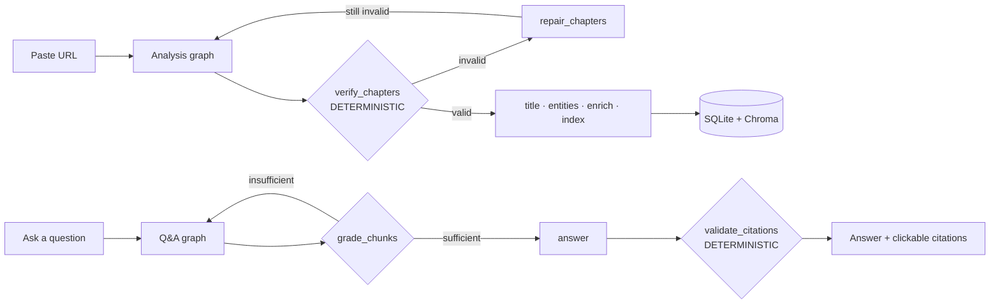

# VideoMind

**Paste a YouTube link → get a chaptered, summarised, searchable video you can
interrogate in natural language, with every answer citing a clickable
timestamp.**

<!-- Record after Phase 9: paste → chapters → question → citation seek. 30s, no
narration. Drop the file at docs/demo.gif and it renders here. -->


## Live demo

<!-- Add the Vercel URL once deployed. -->
**Try it:** _add live demo link_

> First request after idle may take ~50s while the free-tier backend wakes.
> The landing page pings `GET /api/health` on mount and shows "Waking the
> server…" if it's slow. The deployed demo ships three pre-baked videos, so it
> works even when YouTube blocks the host IP.

## What makes it interesting

Most portfolio RAG projects are a chain: prompt in, text out. VideoMind is built
around three theses instead.

1. **LLMs propose, deterministic Python disposes.** Every LLM stage is followed
   by a non-LLM validator that can reject its output. A twelve-rule verifier
   catches bad chapter boundaries; a citation validator strips any timestamp the
   model didn't actually retrieve. No LLM is ever trusted to produce a correct
   timestamp.
2. **The graph is a state machine, not a chain.** Conditional edges —
   skip-enrichment, repair-loop, retrieval-retry — mean two different videos
   take two different paths through the same LangGraph. The retry you see in the
   processing timeline is a real edge firing, not a spinner.
3. **The provider is a runtime parameter, not a build-time dependency.** No
   agent imports `openai`, `google.generativeai`, or `anthropic`. There is one
   seam (`core/llm.py`, the only file allowed to import `litellm`), so switching
   from Gemini to OpenAI in the Settings drawer changes which API is called with
   zero code changes.

The full LangGraph diagram lives in
[`docs/ARCHITECTURE.md`](docs/ARCHITECTURE.md).

## How it works



Nine agents, each making exactly one decision. Two of them are deterministic and
exist to catch the other seven:

| Agent | The one decision it makes |
|---|---|
| `segmentation` | Where do the topic boundaries fall? |
| `verification` *(deterministic)* | Are these chapters structurally valid? |
| `titling` | What is each chapter called and summarised? |
| `entities` | Which named entities deserve a background note? |
| `enrichment` | What blurb + source for each entity? |
| `query_planner` | How should this question be searched — and how hard? |
| `grader` | Is the retrieved context sufficient to answer? |
| `answerer` | What is the grounded answer, with citation markers? |
| `validate_citations` *(deterministic)* | Does every cited timestamp actually exist? |

## The deterministic layer

`agents/verification.py` runs twelve rules over proposed chapters and imports
nothing from the LLM adapter — a test enforces that boundary. Repairs apply in
rule order; if repair still fails, the graph re-segments **once**, never in an
unbounded loop.

| Rule | Check | Auto-repair |
|---|---|---|
| R1 | strictly ordered by `start` | sort |
| R3/R4 | no gaps > 1.0s, no overlaps | snap boundaries |
| R5 | last chapter covers `duration` | extend |
| R7 | every chapter ≥ 45s | merge into shorter neighbour |
| R9 | `3 ≤ n ≤ 25` chapters | merge / re-segment |
| R10 | title ≤ 80 chars, unique | truncate / disambiguate |

_(Abridged — all twelve are in [`docs/ARCHITECTURE.md`](docs/ARCHITECTURE.md).)_

The strongest claim in the project is a **Hypothesis property test**: for *any*
list of random floats read as chapter boundaries,
`build_chapters → repair_chapters → verify_chapters` produces either a valid set
or a report whose only remaining issues are warnings. Structural validity is
proven, not hoped for.

## Provider-agnostic by design

The Settings drawer has four fields — **provider, model, API key, base URL** —
and nothing else. Switching provider changes which API `litellm` calls at
runtime; no agent imports a provider SDK, so there is nothing to recompile.

<!-- Screenshot the Settings drawer and drop it at docs/settings.png. -->


> Your key is sent with each request and used only for that request. It is never
> stored on the server — the code in the LLM adapter makes that literally true.

## Run it locally

```bash
cp .env.example .env          # then add your GEMINI_API_KEY
docker compose up
```

That brings up the backend on `:8000` and the frontend on `:3000` with no
further steps. Open <http://localhost:3000>, paste a link, and go.

**Offline transcription (Whisper)** is available locally but **off in the hosted
demo** (`ENABLE_WHISPER=false`). Free-tier RAM can't run `faster-whisper` without
OOMing, so the hosted demo relies on YouTube captions and the seeded cache;
running VideoMind locally unlocks Whisper for videos that have no captions.

**Pre-bake the demo cache** (optional, recommended before a live demo):

```bash
python backend/scripts/seed_demo_cache.py <url> <url> <url>
```

This processes the videos locally — where YouTube fetching works — into
`backend/data/seed/`. Because local and production share one embedding backend,
the Docker image copies that directory into `DATA_DIR` on first boot, so the
deployed demo always has working videos regardless of network conditions.

## Architecture decisions

The append-only decision log is [`docs/DECISIONS.md`](docs/DECISIONS.md). The
three that shape everything else:

- **One embedding backend, everywhere.** `gemini-embedding-001` runs locally and
  in production — there is no second vector space to keep in sync, which is what
  lets a single seed run produce artefacts valid in both places.
- **768 dimensions, locked at index time.** The collection name encodes model
  and dimension (`chunks__gemini_embedding_001_768`), so an index built at a
  different dimension is a cache miss, not a silent quality collapse.
- **Repair before retry.** A deterministic repair pass fixes bad boundaries
  without an LLM call; only if repair fails does the graph spend a second
  segmentation prompt. Cheap correctness first, expensive correctness last.

## Known limitations

Listing these is a credibility signal, not an apology.

- **Single-instance job runner.** Jobs run in-process behind one semaphore.
  Scaling past one backend replica needs a real queue (Redis + worker); that's a
  deliberate V1 trade-off.
- **YouTube IP blocking.** A deployed host can be blocked from fetching
  captions/audio. Mitigated by `YTDLP_COOKIES_FILE` / `YTDLP_PROXY` support and
  the pre-baked seed cache.
- **Free-tier cold starts.** ~50s on first request after idle; the frontend
  warms the backend on landing-page mount.
- **English-only** transcription and answers.
- **Single-video Q&A** — no cross-video or per-channel search.

## Roadmap

Deferred to keep V1 honest (full list in the plan's §25):

- Multi-source ingestion (Vimeo, direct upload, local file)
- Cross-video search and a per-channel knowledge base
- Multi-language transcription and answer-language selection
- Streaming answers (SSE) — the API shape already allows it
- A real job queue (Redis + worker) for horizontal scaling
- An evaluation harness: 20 labelled questions across 5 videos, scored for
  citation precision and answer groundedness, tracked in MLflow across prompt
  versions. This is the highest-value follow-up — it turns "I built it" into
  "I measured it."

---

Build spec: [`docs/VIDEOMIND_IMPLEMENTATION_PLAN.md`](docs/VIDEOMIND_IMPLEMENTATION_PLAN.md).
Commands: `make dev`, `make test`, `make lint`, `make mlflow`.
