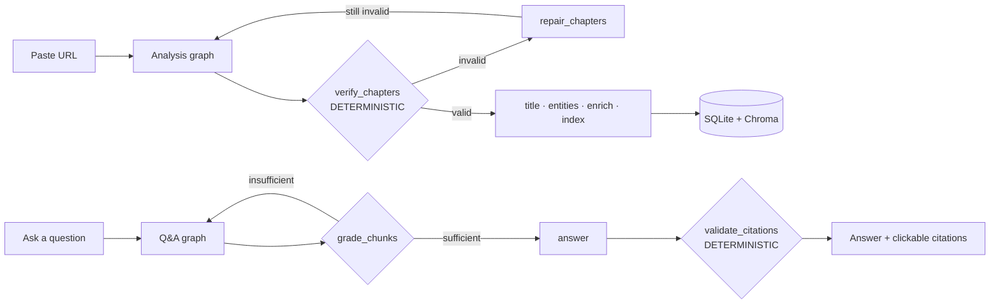
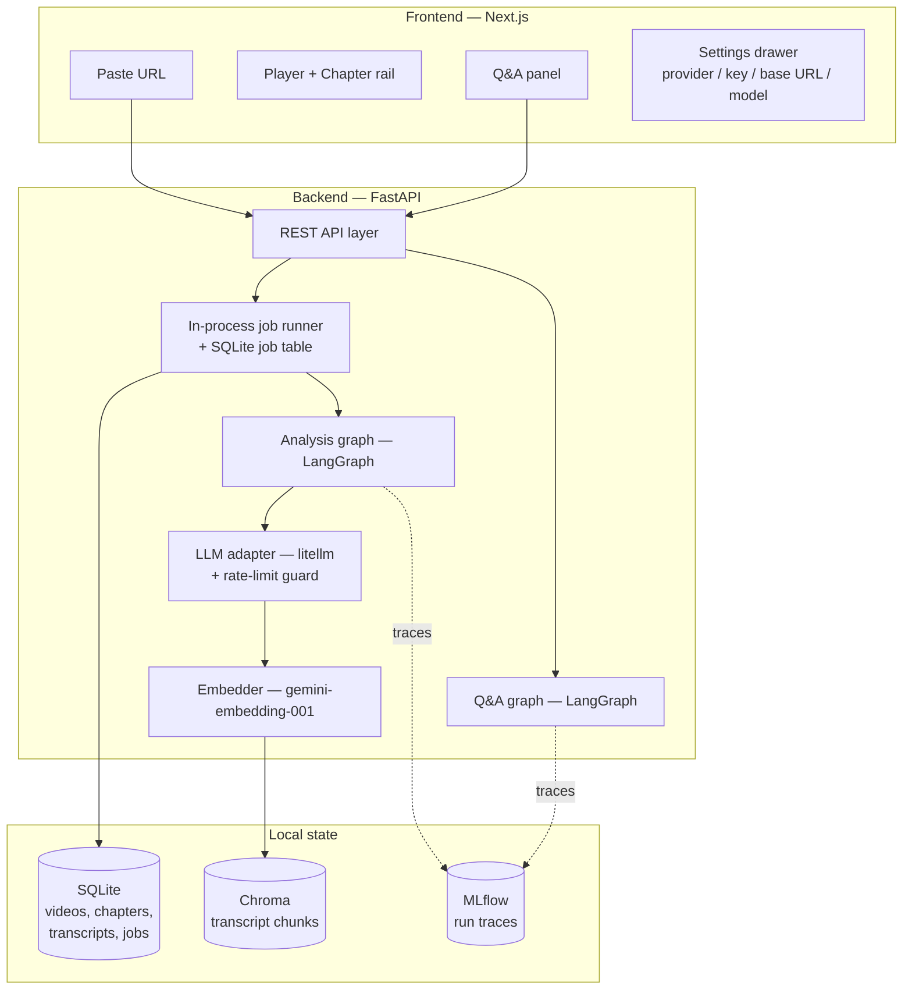

# VideoMind

**Paste a YouTube link, get topic-based chapters and a Q&A agent that answers
questions about the video with clickable timestamp citations.**

<!-- TODO: replace with a demo GIF: paste URL -> chapter rail -> ask a question -> click a citation -->
> 🎬 *Demo GIF coming soon.*

## What it does

1. You paste a YouTube URL.
2. The backend fetches the transcript (captions, or local Whisper as a
   fallback), splits it into topic-based chapters, titles and summarises
   each one, and indexes it for retrieval.
3. You get a chapter rail synced to the video player. Click a chapter and
   the player seeks there.
4. You ask questions in a chat panel. Every answer cites the timestamp it
   came from, and clicking the citation seeks the player to it.

## Why I built it

Nobody asked for this. I wanted to build an agent system where the LLM is
not trusted to be right: most RAG demos are one chain (prompt in, text
out), and a wrong timestamp or an invented citation goes straight to the
user. VideoMind is my attempt at the alternative, where each LLM step is
followed by something that can reject it.

## Architecture in brief

- **Multi-agent orchestration on LangGraph.** Two graphs: an *analysis*
  graph (resolve, transcript, segment, verify/repair, title, entities,
  enrich, index, persist) and a *Q&A* graph (plan query, retrieve, grade,
  answer, validate citations). Seven LLM agents and two deterministic
  ones, each making one decision. Conditional edges mean different videos
  and questions take different paths through the same graph.
- **Corrective-RAG retry loop.** After retrieval, a grader LLM decides
  whether the retrieved chunks are sufficient. If not, the query planner
  runs again with the grader's "missing information" and a different
  strategy (direct, then decompose into sub-queries), for at most two
  retrieval passes. If nothing relevant is found, the graph returns a
  fixed "I couldn't find that in this video" answer instead of guessing.
- **Deterministic guardrails between LLM stages.** Chapters go through a
  12-rule verifier (`agents/verification.py`, no LLM imports, enforced by a
  test) with automatic repair; if repair fails the graph re-segments once.
  Answers go through a citation validator that drops any citation whose
  chunk wasn't actually retrieved and takes timestamps from chunk metadata,
  never from the model.
- **Provider is a runtime parameter.** Only `core/llm.py` imports
  `litellm`; the Settings drawer selects provider, model, key and base URL
  per request.

Details, diagrams and the rule table are in [How it works](#how-it-works).
Design decisions are in [DECISIONS.md](DECISIONS.md).

## Status

**Done and covered by automated tests** (179 backend tests, which use a fake
LLM and no network; 9 frontend unit tests; 1 mocked-API Playwright test):
- Ingestion: URL parsing, four-rung transcript ladder, sentence
  normalisation, SQLite cache.
- Embeddings (Gemini, 768d, re-normalised), chapter-aware chunking, Chroma
  vector store, recall, MMR and chronological retrieval.
- Segmentation, the R1-R12 verifier and repair, including a Hypothesis
  property test.
- Titling, entity extraction, Wikipedia enrichment.
- Both LangGraph graphs, MLflow tracing, the citation validator.
- FastAPI endpoints, in-process job runner, per-IP rate limit.
- Next.js frontend: chapter rail, player, Q&A panel with agent trace,
  settings drawer. The Playwright smoke test runs against a mocked API.

**Written but not verified end to end:**
- `docker compose up` (Dockerfiles and compose file exist).
- Non-Gemini providers (OpenAI, Anthropic, custom endpoint): only the
  provider mapping is unit-tested; there are no live-API tests.
- Local Whisper fallback.

**Not done:**
- No deployed demo and no committed seed cache
  (`backend/scripts/seed_demo_cache.py` exists but its output is not in
  the repo).
- No evaluation harness for answer quality or citation precision (see
  Roadmap). There are no benchmark numbers for this project.
- Demo GIF.
- The retrieval escalation table in `app/config.py` has a third
  "keyword" row, but `MAX_RETRIEVAL_ATTEMPTS = 2` means only the first two
  rows are ever used.
- If chapters still fail verification after repair and re-segmentation,
  the pipeline proceeds with the best chapters it has rather than failing
  the job.

## How it works





Nine agents, each making exactly one decision. Two of them are
deterministic and exist to catch the other seven:

| Agent | The one decision it makes | Kind |
|---|---|---|
| `segmentation` | Where do the topic boundaries fall? | LLM + deterministic candidates |
| `verification` | Are these chapters structurally valid (R1–R12)? | **Deterministic** |
| `titling` | What is each chapter called and summarised? | LLM |
| `entities` | Which named entities deserve a background note? | LLM |
| `enrichment` | What blurb + source for each entity? | LLM + Wikipedia |
| `query_planner` | How should this question be searched — and how hard? | LLM |
| `grader` | Is the retrieved context sufficient to answer? | LLM |
| `answerer` | What is the grounded answer, with citation markers? | LLM |
| `validate_citations` | Does every cited timestamp actually exist? | **Deterministic** |

### The deterministic layer

`backend/app/agents/verification.py` runs twelve rules over proposed
chapters and imports nothing from the LLM adapter — a test enforces that
boundary. Repairs apply in rule order; if repair still fails, the graph
re-segments **once**, never in an unbounded loop.

| Rule | Check | Auto-repair |
|---|---|---|
| R1 | strictly ordered by `start` | sort |
| R3/R4 | no gaps > 1.0s, no overlaps | snap boundaries |
| R5 | last chapter covers `duration` | extend |
| R7 | every chapter ≥ 45s | merge into shorter neighbour |
| R9 | `3 ≤ n ≤ 25` chapters | merge / re-segment |
| R10 | title ≤ 80 chars, unique | truncate / disambiguate |

The strongest test in the project is a **Hypothesis property test**: for
random lists of floats read as chapter boundaries,
`build_chapters → repair_chapters → verify_chapters` produces either a
valid set or a report whose only remaining issues are warnings. That is
property-based testing, not a formal proof.

### Provider-agnostic by design

The Settings drawer has four fields — **provider, model, API key, base
URL** — and nothing else. Switching provider changes which API `litellm`
calls at runtime; no agent imports a provider SDK. (Only the provider
mapping is unit-tested; see Status.) Your key is sent with each request and used only for that
request — it is never stored on the server.

### Persistence

- **SQLite** (`$DATA_DIR/videomind.sqlite3`) holds videos, transcripts,
  chapters, enrichments, and the job table.
- **Chroma** (`$DATA_DIR/chroma`) holds transcript chunks in a
  model-scoped collection (`chunks__gemini_embedding_001_768`). The
  collection name encodes the embedding model and dimension, so an index
  built at a different dimension can never be silently queried against.
- **One embedding space, everywhere.** `gemini-embedding-001` at 768
  dimensions runs locally and in production. Vectors are re-normalised to
  unit norm after MRL truncation.

## Project layout

```
backend/    FastAPI app — agents/, graphs/ (LangGraph), core/ (llm, embedder,
            db, vectorstore), ingestion/ (YouTube, captions, Whisper),
            schemas/, prompts/ (*.md), tests/
frontend/   Next.js app — player, chapter rail, chat panel, settings drawer
docker-compose.yml   backend + frontend, one populated .env
DECISIONS.md         architectural decision log
```

## Setup

### 1. Prerequisites

- Python 3.11, Node 18+
- `ffmpeg` on your PATH (for local Whisper transcription fallback)
- A free Gemini API key (see below) — this is the only credential you
  actually need

### 2. Get a free Gemini API key

Gemini powers **both** the LLM and the embeddings — one key, one backend,
everywhere.

1. Go to **[aistudio.google.com/apikey](https://aistudio.google.com/apikey)**
   and sign in with a Google account.
2. Click **Create API key**. No billing account or credit card required.
3. Copy the key.

### 3. (Optional) Get a free YouTube Data API key

Not required — without it, the app falls back to scraping video metadata
via `yt-dlp`, which works fine for most videos. Add a real key only if
you want more reliable metadata:

1. Go to **[console.cloud.google.com](https://console.cloud.google.com)**,
   create (or reuse) a project.
2. **APIs & Services → Library** → search **YouTube Data API v3** →
   **Enable**.
3. **APIs & Services → Credentials → Create Credentials → API key**.
   Free, no billing required.
4. (Recommended) Restrict the key to YouTube Data API v3 only.

### 4. Configure and run

```bash
cp .env.example .env
# edit .env: set GEMINI_API_KEY (required), YOUTUBE_API_KEY (optional)

docker compose up
```

A valid `GEMINI_API_KEY` is required: the backend probes the embedding API
on startup and exits if it fails. That brings up the backend on `:8000` and the frontend on `:3000` with no
further steps. Open <http://localhost:3000>, paste a link, and go.

**Running without Docker:**

```bash
# terminal 1 — backend (reads the repo-root .env)
python3.11 -m venv .venv && source .venv/bin/activate
pip install -e "backend[dev]"
make dev            # http://localhost:8000

# terminal 2 — frontend
cd frontend && npm install
npm run dev          # http://localhost:3000
```

> If you edit `.env` while the backend is running, **restart it**.
> Settings are loaded once at process startup — `--reload` watches `.py`
> files, not `.env`.

**Offline transcription (Whisper)** runs locally as a fallback for videos
with no captions (`ENABLE_WHISPER=true` by default). Set it to `false` in
any low-memory / production deployment — `faster-whisper` needs more RAM
than most free-tier hosts provide.

## Commands

- `make dev`    — run the backend locally
- `make test`   — pytest (backend test suite)
- `make lint`   — ruff check + format check
- `make mlflow` — open the local MLflow UI (traces for every graph run)

## Known limitations

Listing these is a credibility signal, not an apology.

- **Single-instance job runner.** Jobs run in-process behind one
  semaphore. Scaling past one backend replica needs a real queue (Redis +
  worker) — a deliberate V1 trade-off.
- **YouTube IP blocking.** A deployed host can be blocked from fetching
  captions/audio. Mitigated by `YTDLP_COOKIES_FILE` / `YTDLP_PROXY`
  support and a pre-baked seed cache (`backend/scripts/seed_demo_cache.py`).
- **Free-tier cold starts.** ~50s on first request after idle on a
  free-tier host; the frontend warms the backend on landing-page mount.
- **English-only** transcription and answers.
- **Single-video Q&A** — no cross-video or per-channel search.

## Roadmap

- Multi-source ingestion (Vimeo, direct upload, local file)
- Cross-video search and a per-channel knowledge base
- Multi-language transcription and answer-language selection
- Streaming answers (SSE) — the API shape already allows it
- A real job queue (Redis + worker) for horizontal scaling
- An evaluation harness: labelled questions scored for citation precision
  and answer groundedness, tracked in MLflow across prompt versions
