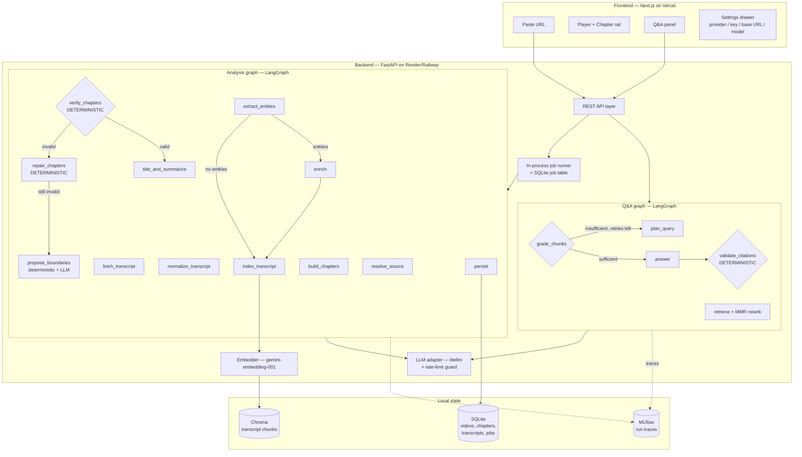

# VideoMind architecture

VideoMind turns a YouTube link into a chaptered, searchable video you can
interrogate in natural language, with every answer citing a clickable
timestamp. This document is the map; the authoritative spec is
[`VIDEOMIND_IMPLEMENTATION_PLAN.md`](VIDEOMIND_IMPLEMENTATION_PLAN.md).

## System diagram

## Three theses

1. **LLMs propose, deterministic Python disposes.** Every LLM stage is followed
   by a non-LLM validator that can reject its output. Segmentation is validated
   by `verify_chapters`; answers are validated by `validate_citations`. No LLM
   is ever trusted to produce a correct timestamp.
2. **The graph is a state machine, not a chain.** Conditional edges
   (skip-enrichment, repair-loop, retrieval-retry) mean two different videos
   take two different paths through the same graph.
3. **The provider is a runtime parameter, not a build-time dependency.** No
   agent imports `openai`, `google.generativeai`, or `anthropic`. Ever. There is
   exactly one seam — `core/llm.py` — and it is the only file allowed to import
   `litellm`.

## The nine decision points

Each agent makes exactly one decision. Two of the nine are deterministic and
exist to catch the other seven.

| # | Agent | The one decision it makes | Kind |
|---|---|---|---|
| 1 | `segmentation` | Where do the topic boundaries fall? | LLM + deterministic candidates |
| 2 | `verification` | Are these chapters structurally valid (R1–R12)? | **Deterministic** |
| 3 | `titling` | What is each chapter called, summarised, and keyed on? | LLM |
| 4 | `entities` | Which named entities are worth a background note? | LLM |
| 5 | `enrichment` | What is the one-line blurb + source for each entity? | LLM + Wikipedia |
| 6 | `query_planner` | How should this question be searched — and how hard? | LLM |
| 7 | `grader` | Is the retrieved context sufficient to answer? | LLM |
| 8 | `answerer` | What is the grounded answer, with `[[c…]]` markers? | LLM |
| 9 | `validate_citations` | Does every cited chunk id / timestamp actually exist? | **Deterministic** |

## The deterministic layer (R1–R12)

`agents/verification.py` runs twelve rules over the proposed chapters. It
imports nothing from `core/llm.py` — a test enforces that boundary. Repairs are
applied in rule order, then the graph re-verifies; if repair still fails, the
graph re-segments **once**. Repair never calls an LLM and is idempotent.

| Rule | Check | Severity | Auto-repair |
|---|---|---|---|
| R1 | strictly ordered by `start` | error | sort |
| R2 | first chapter starts at ~0 | error | clamp to 0 |
| R3 | no gaps > 1.0s between chapters | error | snap `end` to next `start` |
| R4 | no overlaps | error | snap |
| R5 | last chapter covers `duration` | error | extend |
| R6 | every bound in `[0, duration]` | error | clamp, drop empties |
| R7 | every chapter ≥ 45s | error | merge into shorter neighbour |
| R8 | every chapter ≤ `max(900, 0.35·duration)` | warning | — |
| R9 | `3 ≤ n ≤ 25` and `n ≤ duration/45` | error | merge / re-segment |
| R10 | title non-empty, ≤ 80 chars, unique | error | truncate / disambiguate |
| R11 | summary present, 2–4 key points | error | re-ask titling |
| R12 | each boundary sits on a sentence unit | warning | snap |

**The strongest correctness claim in the project** is a Hypothesis property
test: for any list of random floats in `[0, duration]` read as boundaries,
`build_chapters → repair_chapters → verify_chapters` yields either `valid=True`
or a report whose only remaining issues are warnings. Structural validity is not
hoped for — it is proven.

## Persistence and the single embedding backend

- **SQLite** (`$DATA_DIR/videomind.sqlite3`) holds videos, transcripts,
  chapters, enrichments, and the job table. Job state lives here, not in a
  process dict, so a restart mid-job leaves an honest `failed` record.
- **Chroma** (`$DATA_DIR/chroma`) holds transcript chunks in a
  model-scoped collection (`chunks__gemini_embedding_001_768`). The collection
  name encodes the embedding model and dimension, so an index built at a
  different dimension can never be silently queried against.
- **One embedding space, everywhere.** `gemini-embedding-001` at 768d runs
  locally and in production. Vectors are re-normalised to unit norm after MRL
  truncation. There is no second vector space to keep in sync, which is what
  makes the pre-baked seed cache (§21.3) valid in both places from a single run.

## Deployment topology

| Piece | Host | Notes |
|---|---|---|
| Frontend | Vercel | `NEXT_PUBLIC_API_BASE_URL` → backend URL |
| Backend | Render (Docker, free web service) | Persistent disk at `/data`, `DATA_DIR=/data` |

The backend runs a single in-process job runner behind an
`asyncio.Semaphore(MAX_CONCURRENT_JOBS)`. This is a deliberate V1 trade-off:
scaling past one replica needs a real queue (Redis + worker). Knowing exactly
which line breaks first under horizontal scaling is the point — see
[Known limitations](../README.md#known-limitations).
