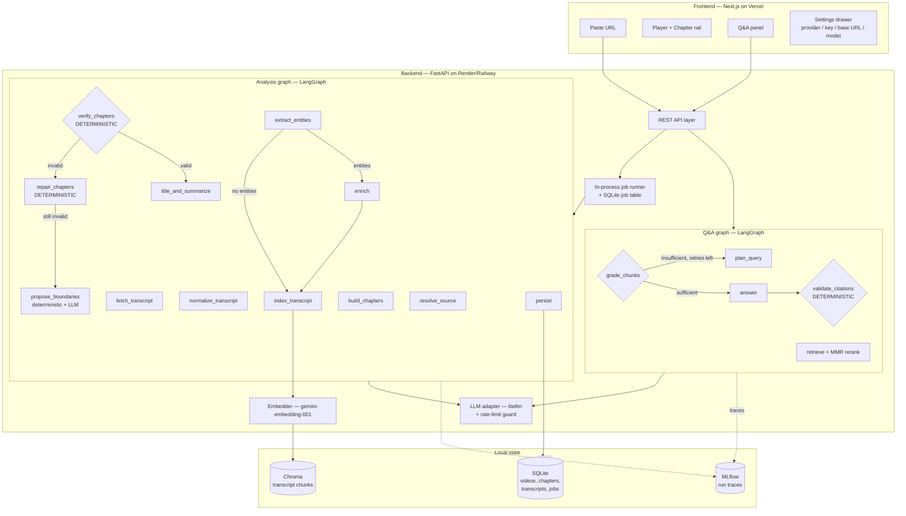

# VideoMind — Implementation Plan (Build Specification)

**Audience:** Claude Code (autonomous build agent)
**Author:** Aayush Kumar
**Source brief:** `videomind-project-brief.md`
**Status:** Authoritative. Where this document and the brief disagree, this document wins — every deviation is justified inline under a `> **Deviation:**` callout.

---

## 0. How to use this document

1. Build **strictly in the phase order defined in §22**. Do not jump ahead. Each phase has a *Definition of Done* and a *verify command*. A phase is not complete until its verify command passes.
2. Before starting a phase, re-read the sections it references. Section numbers are stable.
3. Every schema, endpoint, filename, env var, and threshold in this document is **normative**. Do not rename things. Do not invent extra abstraction layers.
4. If you hit a genuine blocker (an API behaves differently than specified, a dependency won't install), **stop, write the finding into `docs/DECISIONS.md`, and pick the documented fallback** listed in §21.2. Do not silently redesign.
5. Commit at the end of every phase with the message format `phase(N): <short description>`.
6. Never write an API key into a log line, a test fixture, a commit, or a file on disk other than a gitignored `.env`.

---

## 1. Product definition & V1 acceptance criteria

### 1.1 The one-sentence job

Paste a YouTube link → get a chaptered, summarised, searchable video you can interrogate in natural language, with every answer citing a clickable timestamp.

### 1.2 V1 acceptance criteria (this is the finish line)

A build is "done" when all of the following are true on a fresh clone:

| # | Criterion | How it's verified |
|---|---|---|
| A1 | `docker compose up` brings up backend + frontend locally with no manual steps beyond copying `.env.example` → `.env` | Manual, documented in README |
| A2 | Pasting a 10–30 min YouTube URL produces chapters within 90s (captions path, warm cache miss) | `scripts/e2e_smoke.py` |
| A3 | Every chapter has: start, end, title ≤ 80 chars, summary, 2–4 key points | Verification agent + `test_verification.py` |
| A4 | Chapters are contiguous: no gaps > 1.0s, no overlaps, cover `[0, duration]` | `test_verification.py` (property tests) |
| A5 | Asking a question returns an answer with ≥ 1 citation whose timestamp exists in the transcript | `test_qa_graph.py` |
| A6 | Clicking a citation seeks the embedded player to that second | Manual + Playwright smoke |
| A7 | Switching provider in the Settings panel from Gemini → OpenAI changes which API is called, with **zero code changes** | `test_llm_adapter.py` + manual |
| A8 | Re-processing the same video URL returns from cache in < 2s and makes **zero** LLM calls | `test_cache.py` |
| A9 | A deliberately corrupt segmentation output triggers deterministic repair, and if repair fails, one re-segmentation retry — never an unhandled crash | `test_verification_repair.py` |
| A10 | CI is green on `main`: ruff, pytest, frontend build | GitHub Actions |
| A11 | No API key appears in any log, MLflow param, or response body | `test_secret_leakage.py` |

### 1.3 Explicit non-goals for V1

Multi-source ingestion (Vimeo, uploads), cross-video search, multi-language transcription, user accounts/auth, multi-tenant persistence, GPU inference, real-time/live video.

---

## 2. Architecture overview



### 2.1 The three architectural theses (these are the interview talking points — protect them)

1. **LLMs propose, deterministic Python disposes.** Every LLM stage is followed by a non-LLM validator that can reject its output. Segmentation is validated by `verify_chapters`; answers are validated by `validate_citations`. No LLM is ever trusted to produce a correct timestamp.
2. **The graph is a state machine, not a chain.** Conditional edges (skip-enrichment, repair-loop, retrieval-retry) mean two different videos take two different paths through the same graph.
3. **The provider is a runtime parameter, not a build-time dependency.** No agent imports `openai`, `google.generativeai`, or `anthropic`. Ever.

---

## 3. Coding standards (non-negotiable)

These reflect the author's canonical style. Claude Code must follow them or the review will fail.

- **Simple and linear.** Code reads top-to-bottom like clear thinking. No clever indirection.
- **No speculative abstraction.** No base classes, factories, or plugin registries with exactly one implementation. The *only* sanctioned abstractions are the LLM adapter (§7) and the embedder interface (§12.2), because both genuinely have more than one implementation.
- **No defensive try/except spam.** Catch an exception only where you can do something meaningful about it (retry, fall back, surface a typed error). Bare `except Exception: pass` is banned.
- **No logging noise.** One log line per meaningful state transition, not per function entry.
- **No dead code, no unused variables, no commented-out blocks.** Delete it; git has it.
- **No hardcoded data.** All config comes from environment variables via a single `settings.py`. No magic numbers inline — thresholds live in `app/config.py` as named constants.
- **Module-level clients only when the function is called repeatedly at runtime** (e.g. the Chroma client, the embedder). One-shot startup work resolves once at startup, not per request.
- **Predictable return values.** A function returns one type. Not `dict | None | False`.
- **Type hints everywhere** in `backend/app/**`. `ruff` + `mypy --strict` on `app/core` and `app/agents`.
- **Prompts live in files, not in code.** `backend/app/prompts/*.md`, loaded by name. This keeps agent code readable and makes prompt diffs reviewable.
- **Pydantic v2** for every LLM input/output boundary. **TypedDict** for LangGraph state (partial-update semantics are cleaner and avoid Pydantic revalidation on every node return).

---

## 4. Repo structure

Monorepo, as the brief suggests. Single GitHub repo, two deployable units.

```
videomind/
├── README.md
├── LICENSE
├── .gitignore
├── .env.example
├── docker-compose.yml
├── Makefile
├── docs/
│   ├── ARCHITECTURE.md
│   ├── DECISIONS.md          # append-only ADR log; you write to this
│   ├── DEMO_SCRIPT.md
│   └── API.md                # generated summary of §15
├── .github/
│   └── workflows/
│       ├── backend.yml
│       └── frontend.yml
├── backend/
│   ├── Dockerfile
│   ├── pyproject.toml
│   ├── ruff.toml
│   ├── app/
│   │   ├── main.py                 # FastAPI app, routers, lifespan
│   │   ├── config.py               # Settings (pydantic-settings) + tuning constants
│   │   ├── api/
│   │   │   ├── routes_videos.py
│   │   │   ├── routes_jobs.py
│   │   │   ├── routes_qa.py
│   │   │   ├── routes_health.py
│   │   │   └── deps.py             # per-request LLMConfig resolution
│   │   ├── core/
│   │   │   ├── llm.py              # LLM adapter (§7)
│   │   │   ├── ratelimit.py        # token-bucket guard (§8)
│   │   │   ├── embedder.py         # Gemini (default) + sentence-transformers (§12.2)
│   │   │   ├── vectorstore.py      # Chroma wrapper (§12.3)
│   │   │   ├── db.py               # sqlite3, schema init, typed row helpers (§5)
│   │   │   ├── prompts.py          # load_prompt(name) -> str
│   │   │   ├── tracing.py          # MLflow run/span helpers (§17)
│   │   │   └── errors.py           # typed domain errors
│   │   ├── ingestion/
│   │   │   ├── youtube.py          # URL parse, metadata via Data API v3
│   │   │   ├── captions.py         # youtube-transcript-api → yt-dlp fallback
│   │   │   ├── whisper.py          # faster-whisper local fallback
│   │   │   └── normalize.py        # cues -> sentence units (§9.4)
│   │   ├── agents/
│   │   │   ├── segmentation.py
│   │   │   ├── titling.py
│   │   │   ├── entities.py
│   │   │   ├── enrichment.py
│   │   │   ├── verification.py     # DETERMINISTIC, no LLM import
│   │   │   ├── query_planner.py
│   │   │   ├── grader.py
│   │   │   └── answerer.py
│   │   ├── graphs/
│   │   │   ├── analysis_graph.py
│   │   │   ├── qa_graph.py
│   │   │   └── state.py            # AnalysisState, QAState TypedDicts
│   │   ├── prompts/
│   │   │   ├── segmentation.md
│   │   │   ├── titling.md
│   │   │   ├── entities.md
│   │   │   ├── enrichment.md
│   │   │   ├── query_plan.md
│   │   │   ├── grading.md
│   │   │   └── answer.md
│   │   ├── schemas/
│   │   │   ├── transcript.py
│   │   │   ├── chapters.py
│   │   │   ├── enrichment.py
│   │   │   ├── qa.py
│   │   │   └── api.py              # request/response models (§15)
│   │   └── services/
│   │       ├── jobs.py             # job registry + background runner
│   │       └── pipeline.py         # thin orchestration entry points
│   ├── scripts/
│   │   ├── ingest_cli.py           # process one URL from terminal, no API
│   │   ├── e2e_smoke.py
│   │   └── seed_demo_cache.py      # pre-bake demo videos (§21.3)
│   └── tests/
│       ├── conftest.py
│       ├── fixtures/
│       │   ├── transcript_short.json
│       │   ├── transcript_long.json
│       │   └── llm_responses.json
│       ├── fakes/
│       │   └── fake_llm.py
│       ├── test_imports.py
│       ├── test_llm_adapter.py
│       ├── test_ratelimit.py
│       ├── test_normalize.py
│       ├── test_chunking.py
│       ├── test_embedder.py
│       ├── test_verification.py
│       ├── test_verification_repair.py
│       ├── test_segmentation.py
│       ├── test_analysis_graph.py
│       ├── test_qa_graph.py
│       ├── test_api.py
│       ├── test_cache.py
│       └── test_secret_leakage.py
└── frontend/
    ├── package.json
    ├── next.config.ts
    ├── tailwind.config.ts
    ├── Dockerfile
    ├── app/
    │   ├── layout.tsx
    │   ├── page.tsx                # paste-URL landing
    │   ├── v/[videoId]/page.tsx    # workspace
    │   └── globals.css
    ├── components/
    │   ├── UrlForm.tsx
    │   ├── ProcessingTimeline.tsx
    │   ├── VideoPlayer.tsx         # YouTube IFrame wrapper, exposes seekTo
    │   ├── ChapterRail.tsx
    │   ├── ChapterCard.tsx
    │   ├── EnrichmentPopover.tsx
    │   ├── ChatPanel.tsx
    │   ├── CitationChip.tsx
    │   ├── AgentTrace.tsx          # shows which nodes ran + retries (demo gold)
    │   └── SettingsDrawer.tsx
    ├── lib/
    │   ├── api.ts                  # typed fetch client
    │   ├── types.ts                # mirrors §15 schemas
    │   └── settings.ts             # localStorage-backed LLM config
    └── tests/
        └── smoke.spec.ts
```

---

## 5. Persistence: SQLite schema

Use the **stdlib `sqlite3`** module with a thin `db.py`. No ORM — the schema is five tables and the queries are trivial; SQLAlchemy would be exactly the kind of abstraction §3 forbids.

`backend/app/core/db.py` owns: connection factory (`check_same_thread=False`, `PRAGMA journal_mode=WAL`), `init_schema()` called from FastAPI lifespan, and one function per query.

```sql
CREATE TABLE IF NOT EXISTS videos (
    video_id        TEXT PRIMARY KEY,          -- YouTube 11-char id
    url             TEXT NOT NULL,
    title           TEXT NOT NULL,
    channel         TEXT,
    duration        REAL NOT NULL,             -- seconds
    thumbnail_url   TEXT,
    published_at    TEXT,
    transcript_source TEXT NOT NULL,           -- 'captions' | 'whisper'
    language        TEXT NOT NULL,
    status          TEXT NOT NULL,             -- 'ready' | 'failed'
    created_at      TEXT NOT NULL,
    analysis_version INTEGER NOT NULL DEFAULT 1,
    embedding_model TEXT NOT NULL,             -- e.g. 'gemini-embedding-001'
    embedding_dim   INTEGER NOT NULL           -- e.g. 768
);

CREATE TABLE IF NOT EXISTS transcripts (
    video_id  TEXT PRIMARY KEY REFERENCES videos(video_id) ON DELETE CASCADE,
    cues_json TEXT NOT NULL                    -- list[TranscriptCue], raw
);

CREATE TABLE IF NOT EXISTS chapters (
    video_id    TEXT NOT NULL REFERENCES videos(video_id) ON DELETE CASCADE,
    chapter_id  TEXT NOT NULL,                 -- f"{video_id}:ch{index:02d}"
    idx         INTEGER NOT NULL,
    start       REAL NOT NULL,
    end         REAL NOT NULL,
    title       TEXT NOT NULL,
    summary     TEXT NOT NULL,
    key_points_json TEXT NOT NULL,
    PRIMARY KEY (video_id, chapter_id)
);

CREATE TABLE IF NOT EXISTS enrichments (
    video_id    TEXT NOT NULL REFERENCES videos(video_id) ON DELETE CASCADE,
    entity      TEXT NOT NULL,
    kind        TEXT NOT NULL,
    blurb       TEXT NOT NULL,
    source_url  TEXT,
    first_mention REAL NOT NULL,
    PRIMARY KEY (video_id, entity)
);

CREATE TABLE IF NOT EXISTS jobs (
    job_id      TEXT PRIMARY KEY,              -- uuid4
    video_id    TEXT,
    url         TEXT NOT NULL,
    status      TEXT NOT NULL,                 -- 'queued'|'running'|'done'|'failed'
    stage       TEXT,                          -- current LangGraph node name
    progress    REAL NOT NULL DEFAULT 0.0,     -- 0..1, from STAGE_WEIGHTS
    error_code  TEXT,
    error_message TEXT,
    retries_json TEXT NOT NULL DEFAULT '{}',   -- {"segmentation": 1, "retrieval": 0}
    created_at  TEXT NOT NULL,
    updated_at  TEXT NOT NULL
);

CREATE INDEX IF NOT EXISTS idx_chapters_video ON chapters(video_id, idx);
CREATE INDEX IF NOT EXISTS idx_jobs_status ON jobs(status);
```

**Cache key.** `videos.video_id + analysis_version + embedding_model`. A video indexed under a different embedder is a cache *miss*, not a hit (§12.3). If a row exists with `status='ready'` and `analysis_version = CURRENT_ANALYSIS_VERSION`, `POST /api/videos` returns it immediately with `cached: true` and **makes zero LLM calls** (criterion A8). Bump `CURRENT_ANALYSIS_VERSION` in `config.py` whenever prompts or segmentation logic change.

**Chroma** stores the chunk vectors; SQLite stores everything else. Both live under `DATA_DIR` (`./data` locally, a mounted persistent disk in production).

---

## 6. Pydantic schemas

All under `backend/app/schemas/`. These are the contracts. Do not add fields not listed here without recording an ADR.

### 6.1 `transcript.py`

```python
from pydantic import BaseModel, Field
from typing import Literal

class TranscriptCue(BaseModel):
    start: float = Field(ge=0)
    end: float = Field(ge=0)
    text: str

class SentenceUnit(BaseModel):
    """Post-normalization atom. Everything downstream indexes on these."""
    idx: int
    start: float
    end: float
    text: str

class Transcript(BaseModel):
    video_id: str
    source: Literal["captions", "whisper"]
    language: str
    duration: float
    units: list[SentenceUnit]
```

### 6.2 `chapters.py`

```python
from typing import Literal
from pydantic import BaseModel, Field

# --- LLM output: segmentation agent ---
class ProposedBoundary(BaseModel):
    start: float = Field(ge=0, description="Second at which a new topic begins")
    reason: str = Field(max_length=160, description="Why the topic shifts here")

class SegmentationOutput(BaseModel):
    boundaries: list[ProposedBoundary]

# --- LLM output: titling agent (one call per batch of chapters) ---
class ChapterCard(BaseModel):
    idx: int
    title: str = Field(min_length=3, max_length=80)
    summary: str = Field(min_length=20, max_length=400)
    key_points: list[str] = Field(min_length=2, max_length=4)

class TitlingOutput(BaseModel):
    cards: list[ChapterCard]

# --- Internal, post-verification ---
class Chapter(BaseModel):
    chapter_id: str
    idx: int
    start: float
    end: float
    title: str = ""
    summary: str = ""
    key_points: list[str] = []

# --- Verification report (deterministic) ---
class VerificationIssue(BaseModel):
    rule: str
    severity: Literal["error", "warning"]
    detail: str
    chapter_idx: int | None = None

class VerificationReport(BaseModel):
    valid: bool
    issues: list[VerificationIssue]
    repaired: bool = False
```

### 6.3 `enrichment.py`

```python
from typing import Literal
from pydantic import BaseModel, Field

class Entity(BaseModel):
    name: str = Field(max_length=80)
    kind: Literal["person", "organization", "technology",
                  "concept", "place", "event", "product"]
    first_mention: float
    needs_enrichment: bool

class EntityExtraction(BaseModel):
    entities: list[Entity] = Field(max_length=15)

class EnrichmentNote(BaseModel):
    entity: str
    kind: str
    blurb: str = Field(max_length=300)
    source_url: str | None = None
    first_mention: float
```

### 6.4 `qa.py`

```python
from typing import Literal
from pydantic import BaseModel, Field

class QueryPlan(BaseModel):
    rewritten_query: str
    sub_queries: list[str] = Field(max_length=3)
    strategy: Literal["direct", "decompose", "hyde", "keyword"]
    top_k: int = Field(ge=3, le=20)

class ChunkGrade(BaseModel):
    chunk_id: str
    relevant: bool
    score: float = Field(ge=0, le=1)

class GradingOutput(BaseModel):
    grades: list[ChunkGrade]
    sufficient: bool
    missing_information: str | None = None

class CitationRef(BaseModel):
    """What the LLM is allowed to produce. NO timestamps — it does not get to invent those."""
    chunk_id: str
    quote: str = Field(max_length=200)

class AnswerDraft(BaseModel):
    answer: str          # contains inline markers [[c0]], [[c1]] ...
    citations: list[CitationRef]
    confidence: Literal["high", "medium", "low"]

class Citation(BaseModel):
    """Final, server-resolved. Timestamps come from chunk metadata, never the LLM."""
    marker: str          # "c0"
    chunk_id: str
    start: float
    end: float
    quote: str
    chapter_title: str
```

> **Design note (say this in the interview):** `AnswerDraft` deliberately omits timestamps. The model names a chunk; deterministic code looks up that chunk's real time range. This makes a hallucinated citation structurally impossible — an unknown `chunk_id` is dropped by the validator (§13.5) rather than shown to the user with a fabricated time.

---

## 7. LLM provider abstraction

`backend/app/core/llm.py`. This is the single most important file for the "provider-agnostic" claim. **No other file in the repo may import `litellm`, `openai`, `anthropic`, or `google.generativeai`.** Enforce with a ruff `flake8-tidy-imports` ban rule and a test.

### 7.1 The config object

```python
class LLMConfig(BaseModel):
    provider: Literal["gemini", "openai", "anthropic", "custom"] = "gemini"
    model: str = "gemini-2.5-flash"
    api_key: str | None = None      # NEVER logged, NEVER persisted, NEVER echoed
    base_url: str | None = None
    temperature: float = 0.0
    max_tokens: int = 2048

    def __repr__(self) -> str:      # defensive: keys never leak via repr/traceback
        return f"LLMConfig(provider={self.provider}, model={self.model}, key={'set' if self.api_key else 'unset'})"
```

Provider → litellm model-string mapping lives in one dict:

```python
_PREFIX = {
    "gemini": "gemini/",
    "openai": "openai/",
    "anthropic": "anthropic/",
    "custom": "openai/",   # any OpenAI-compatible endpoint, requires base_url
}
```

### 7.2 The interface — exactly two functions

```python
async def generate(prompt: str, cfg: LLMConfig, *,
                   system: str | None = None) -> str: ...

async def generate_structured(prompt: str, cfg: LLMConfig,
                              schema: type[T], *,
                              system: str | None = None,
                              repair_attempts: int = 1) -> T: ...
```

`generate_structured` behaviour:
1. Call litellm with `response_format={"type": "json_schema", "json_schema": {"name": schema.__name__, "schema": schema.model_json_schema(), "strict": True}}`.
2. Parse → `schema.model_validate_json`.
3. On `ValidationError` or `JSONDecodeError`, send **one** repair turn: original response + the validation error text + "return only valid JSON matching the schema". Then fail with `StructuredOutputError`.
4. Strip markdown fences before parsing (`Gemini` sometimes wraps JSON in ```json fences even in JSON mode).

If a provider rejects `response_format` (custom endpoints often do), catch that specific error once, fall back to prompt-embedded schema instructions (`json.dumps(schema.model_json_schema())` appended to the system prompt) and record `structured_mode="prompt"` on the trace. This is the only sanctioned fallback branch in the adapter.

### 7.3 Where config comes from

- **Frontend → backend, per request.** Every request body that can trigger an LLM call carries an optional `llm` object (§14.1). It is used for that request and discarded.
- **If absent**, the backend falls back to server-side env vars (`DEFAULT_LLM_PROVIDER`, `DEFAULT_LLM_MODEL`, `GEMINI_API_KEY`). This is what runs on the deployed demo.
- **Never persisted.** Not in SQLite, not in MLflow params, not in job rows. `test_secret_leakage.py` asserts this by running a full pipeline with a sentinel key value and grepping the DB file, log capture, and MLflow run directory for that sentinel.

### 7.4 Retry semantics

`generate*` retries on transient errors only — HTTP 429, 500, 502, 503, timeout — with exponential backoff `[1s, 4s, 12s]` plus jitter, capped at 3 attempts. `401/403` (bad key) and `400` (bad request) fail immediately with a typed error surfaced to the user as "Check your API key / model name in Settings". Rate-limit *avoidance* is separate and lives in §8.

---

## 8. Rate-limit guard (deterministic, not try/except)

`backend/app/core/ratelimit.py`. The brief calls for a "deterministic rate-limit-aware retry guard" — build it as a **sliding-window token bucket that gates calls before they're made**, not a reactive catch.

```python
class RateLimiter:
    """Sliding-window limiter, one instance per (provider, model) key.
    Module-level registry because it is called on every LLM invocation."""
    def __init__(self, rpm: int, rpd: int | None = None): ...
    async def acquire(self) -> None:
        """Blocks until a slot is free. Raises DailyQuotaExhausted if rpd is hit."""
```

- Default limits in `config.py`, per provider, overridable by env:
  `GEMINI_RPM=10` (free tier advertises 15 for Flash — run at 10 for headroom), `GEMINI_RPD=1000`, `OPENAI_RPM=60`, `ANTHROPIC_RPM=50`, `CUSTOM_RPM=60`.
- The limiter is acquired inside `llm.generate*`, so no agent has to think about it.
- **Batching is the real mitigation.** Titling makes one call per batch of `TITLING_BATCH_SIZE = 6` chapters, not one per chapter. A 20-chapter video costs 4 titling calls, not 20. Full-pipeline budget for a 30-min video: **≤ 9 LLM calls** (1 segmentation × up to 3 windows, 1–4 titling, 1 entity, 0–1 enrichment). Assert this in `test_analysis_graph.py` with the fake adapter's call counter.
- If `DailyQuotaExhausted` is raised mid-analysis, the job fails with `error_code="quota_exhausted"` and the frontend shows: *"Daily free-tier quota reached. Add your own key in Settings to keep going."*

---

## 9. Ingestion subsystem

### 9.1 URL → video_id

`ingestion/youtube.py::parse_video_id(url) -> str`. Accept `youtube.com/watch?v=`, `youtu.be/`, `youtube.com/shorts/`, `youtube.com/embed/`, and bare 11-char IDs. Reject everything else with `UnsupportedSourceError`. Unit-test with a table of 12 URL forms including ones with `&t=`, playlists, and trailing slashes.

### 9.2 Metadata

YouTube Data API v3 `videos.list?part=snippet,contentDetails&id={id}` — 1 quota unit. Extract title, channel title, thumbnail (`medium`), `publishedAt`, and ISO-8601 duration → seconds.

If `YOUTUBE_API_KEY` is unset, fall back to `yt-dlp`'s metadata extraction (`--dump-single-json --skip-download`) so the project runs with zero configured keys beyond the LLM. Record which path was used.

### 9.3 Transcript acquisition (ordered ladder)

| Order | Method | Library | Notes |
|---|---|---|---|
| 1 | Manual captions | `youtube-transcript-api` | Best quality; prefer `en`, then any `en-*`, then first available |
| 2 | Auto-generated captions | `youtube-transcript-api` | Most videos; word-level timing is coarse but fine |
| 3 | `yt-dlp` subtitle extraction | `yt-dlp` (`--write-auto-sub --sub-format json3 --skip-download`) | Used when 1–2 are blocked; sometimes succeeds where the API doesn't |
| 4 | Local Whisper | `faster-whisper` | Downloads audio via `yt-dlp -f bestaudio`, transcribes with `WhisperModel(WHISPER_MODEL, device="cpu", compute_type="int8")`, `WHISPER_MODEL=base` default |

Each rung is attempted once; failures are logged with the rung name and the pipeline moves down. If all four fail → job fails with `error_code="transcript_unavailable"` and a user-facing message naming the likely cause.

> **Deviation / risk flag:** The brief lists yt-dlp first. Reordering to put `youtube-transcript-api` first is a pure win — it's one HTTP call with no subprocess. More importantly: **YouTube throttles caption and audio requests from datacenter IPs.** Rungs 1–4 all work reliably from a laptop; on Render/Railway they may all fail. Mitigations are specified in §21.3 and must be built in Phase 2, not bolted on later.

Guardrails:
- `MAX_VIDEO_DURATION = 5400` seconds (90 min). Longer → reject up front with a clear message. Prevents a demo turning into a 20-minute Whisper job.
- Whisper path is **skipped entirely** when `ENABLE_WHISPER=false` (the production default — see §21.2).

### 9.4 Normalization: cues → sentence units

`ingestion/normalize.py`. Caption cues are 2–5 word fragments with jittery timings. Everything downstream (segmentation, chunking, citations) works on **sentence units** instead.

Algorithm (deterministic, no LLM):
1. Sort cues by start; clamp `end = max(end, start + 0.5)`.
2. Merge overlapping/duplicated cues (auto-captions repeat rolling text — dedupe by suffix match).
3. Accumulate cue text until **any** of: sentence-terminal punctuation (`.?!`) followed by whitespace, accumulated duration ≥ `UNIT_MAX_SECONDS = 15`, or accumulated length ≥ `UNIT_MAX_CHARS = 350`.
4. Emit `SentenceUnit(idx, start=first cue start, end=last cue end, text=joined)`.
5. Collapse whitespace; strip `[Music]`, `[Applause]`, `>>` speaker markers.

Test with both fixtures: `transcript_short.json` (5 min, clean punctuation) and `transcript_long.json` (45 min, auto-captions, no punctuation at all — this is the hard case; unit boundaries must then fall on the duration/length limits).

---

## 10. Analysis graph (LangGraph)

### 10.1 State

`graphs/state.py`:

```python
class AnalysisState(TypedDict, total=False):
    # inputs
    job_id: str
    url: str
    video_id: str
    llm: LLMConfig
    # accumulated
    metadata: dict
    transcript: Transcript
    boundaries: list[float]
    chapters: list[Chapter]
    verification: VerificationReport
    entities: list[Entity]
    enrichment: list[EnrichmentNote]
    # control
    segmentation_attempts: int
    stage: str
    errors: list[str]
```

### 10.2 Nodes and edges

```python
g = StateGraph(AnalysisState)
g.add_node("resolve_source", resolve_source)
g.add_node("fetch_transcript", fetch_transcript)
g.add_node("normalize_transcript", normalize_transcript)
g.add_node("propose_boundaries", propose_boundaries)     # LLM
g.add_node("build_chapters", build_chapters)             # deterministic
g.add_node("verify_chapters", verify_chapters)           # deterministic
g.add_node("repair_chapters", repair_chapters)           # deterministic
g.add_node("title_and_summarize", title_and_summarize)   # LLM
g.add_node("extract_entities", extract_entities)         # LLM
g.add_node("enrich", enrich)                             # LLM + search
g.add_node("index_transcript", index_transcript)
g.add_node("persist", persist)

g.add_edge(START, "resolve_source")
g.add_edge("resolve_source", "fetch_transcript")
g.add_edge("fetch_transcript", "normalize_transcript")
g.add_edge("normalize_transcript", "propose_boundaries")
g.add_edge("propose_boundaries", "build_chapters")
g.add_edge("build_chapters", "verify_chapters")

g.add_conditional_edges("verify_chapters", route_after_verify, {
    "ok": "title_and_summarize",
    "repair": "repair_chapters",
    "resegment": "propose_boundaries",
    "give_up": "title_and_summarize",     # ship best-effort chapters, flag in report
})
g.add_edge("repair_chapters", "verify_chapters")
g.add_edge("title_and_summarize", "extract_entities")

g.add_conditional_edges("extract_entities", route_after_entities, {
    "enrich": "enrich",
    "skip": "index_transcript",
})
g.add_edge("enrich", "index_transcript")
g.add_edge("index_transcript", "persist")
g.add_edge("persist", END)
```

Routers (plain functions, no LLM):

```python
def route_after_verify(state) -> str:
    report = state["verification"]
    if report.valid:
        return "ok"
    if not report.repaired:
        return "repair"                                   # try deterministic fix first
    if state.get("segmentation_attempts", 0) < MAX_SEGMENTATION_ATTEMPTS:  # = 2
        return "resegment"
    return "give_up"

def route_after_entities(state) -> str:
    return "enrich" if any(e.needs_enrichment for e in state.get("entities", [])) else "skip"
```

> **Why repair-before-resegment matters:** re-prompting the LLM is slow and costs quota. ~80% of segmentation defects (a boundary 0.4s inside the previous chapter, a 12-second chapter, a boundary past the video end) are mechanically fixable. Only structural failures (2 chapters for a 40-minute video) justify a re-prompt. Say this out loud in the interview — it's the difference between "I added a retry" and "I designed a failure policy".

### 10.3 Progress reporting

`config.py` holds `STAGE_WEIGHTS: dict[str, float]` summing to 1.0, e.g.
`resolve_source 0.05, fetch_transcript 0.30, normalize 0.05, propose_boundaries 0.20, verify/repair 0.05, title_and_summarize 0.20, entities 0.05, enrich 0.05, index 0.05`.
Each node's first action is `jobs.update(job_id, stage=<name>, progress=cumulative_weight)`. The frontend timeline (§16.4) renders directly from this.

### 10.4 Segmentation agent (`agents/segmentation.py`)

Hybrid — deterministic candidates, LLM selection. This keeps token cost flat for long videos and makes the output far more stable.

**Step 1 — candidate boundaries (no LLM).** Embed every sentence unit (already needed for indexing, so this is free). Compute a smoothed cosine distance between the mean vector of the trailing `W=4` units and the leading `W=4` units at each unit boundary. Take local maxima above `mean + 0.8 * std` as candidates. Enforce `MIN_CHAPTER_SECONDS = 45` spacing by keeping the strongest peak in each window.

**Step 2 — LLM refinement.** Send the LLM: video title, duration, target chapter count range, and the transcript rendered as `[mm:ss] text` lines, with candidate boundaries marked `>>>`. Ask it to return the boundaries it endorses plus any it wants to add, as `SegmentationOutput`.

**Windowing for long transcripts.** If the rendered transcript exceeds `SEGMENTATION_CHAR_BUDGET = 45_000` chars, split into windows of that size with 10% overlap, call once per window (max `MAX_SEGMENTATION_WINDOWS = 3`), and merge: concatenate boundaries, sort, drop any boundary within `MIN_CHAPTER_SECONDS` of the previous one.

**Target chapter count:** `clamp(round(duration / 240), 3, 20)` — roughly one chapter per 4 minutes. Pass as guidance, enforce in verification.

**Step 3 — `build_chapters` (deterministic).** Boundaries → chapters: snap each boundary to the nearest `SentenceUnit.start` (a chapter must never begin mid-sentence), prepend `0.0`, set each chapter's `end` to the next chapter's `start`, last chapter's `end = duration`, assign `chapter_id = f"{video_id}:ch{idx:02d}"`.

### 10.5 Titling agent (`agents/titling.py`)

One call per batch of `TITLING_BATCH_SIZE = 6` chapters. Input per chapter: index, `mm:ss–mm:ss`, and the chapter's transcript text truncated to `TITLING_CHAR_BUDGET = 6000` chars (head 70% / tail 30% if it overflows — the end of a segment often carries the conclusion). Output: `TitlingOutput`.

Post-check (deterministic): every requested `idx` is present; titles are unique after casefolding (append a disambiguator if not); no title starts with "Chapter" or "Introduction to" (banned-prefix list in config — cheap way to force specificity). Missing indices trigger one re-ask for just those indices.

### 10.6 Entity + enrichment agents

`extract_entities` runs on the concatenated chapter summaries (not the raw transcript — cheaper and less noisy). Returns `EntityExtraction`, capped at 15. `needs_enrichment` should be true only for things a general audience plausibly wouldn't know; the prompt must say so explicitly and give 2 positive and 2 negative examples.

`enrich` handles at most `MAX_ENRICHMENTS = 6` entities, chosen by earliest first mention. For each: fetch the Wikipedia REST summary (`https://en.wikipedia.org/api/rest_v1/page/summary/{title}` — free, no key, no rate limit worth worrying about). If the page is a disambiguation or 404, fall back to a single LLM call producing a ≤ 40-word blurb with `source_url: null`. One batched LLM call condenses all fetched extracts into `EnrichmentNote` blurbs.

> **Deviation:** the brief says "web search". Wikipedia REST is used instead as the default because it is free, keyless, deterministic, and citable. A pluggable `SEARCH_PROVIDER=wikipedia|tavily|none` env var leaves the door open without adding a paid dependency to V1.

---

## 11. Verification agent — the deterministic core

`agents/verification.py`. **This file must not import anything from `app.core.llm`.** Add a test asserting that.

### 11.1 Rules

| Rule ID | Check | Severity | Auto-repairable |
|---|---|---|---|
| `R1_sorted` | chapters strictly ordered by `start` | error | yes (sort) |
| `R2_starts_at_zero` | `chapters[0].start <= 1.0` | error | yes (clamp to 0) |
| `R3_no_gaps` | `chapters[i].end == chapters[i+1].start` within `1.0s` | error | yes (snap `end` to next `start`) |
| `R4_no_overlap` | `chapters[i].end <= chapters[i+1].start` | error | yes (snap) |
| `R5_covers_end` | `chapters[-1].end >= duration - 2.0` | error | yes (extend) |
| `R6_within_bounds` | every `start`/`end` in `[0, duration]` | error | yes (clamp, drop empties) |
| `R7_min_duration` | every chapter ≥ `MIN_CHAPTER_SECONDS = 45` | error | yes (merge into previous) |
| `R8_max_duration` | every chapter ≤ `max(900, 0.35 * duration)` | warning | no |
| `R9_count_range` | `3 <= n <= 25` and `n <= duration / 45` | error | merge-only (if too many); resegment if too few |
| `R10_title_present` | non-empty, ≤ 80 chars, unique | error | yes (truncate / disambiguate) |
| `R11_summary_present` | non-empty, 2–4 key points | error | no (re-ask titling for that idx) |
| `R12_boundary_on_unit` | each `start` equals some `SentenceUnit.start` | warning | yes (snap) |

`verify_chapters` runs R1–R12, returns `VerificationReport`. R11 is only evaluated after titling; before titling, skip it.

### 11.2 Repair policy

`repair_chapters` applies fixes **in rule order**, then re-runs verification (via the graph edge, not recursively). It sets `report.repaired = True` so the router knows repair has been tried. Repair is idempotent and never calls an LLM.

Merging rule for R7/R9: merge the too-short chapter into whichever neighbour is shorter, taking the surviving neighbour's title. After any merge, re-index and regenerate `chapter_id`s.

### 11.3 Tests (this is your highest-value test file)

`test_verification.py` — one test per rule with a hand-built violating fixture, plus **property tests** using `hypothesis`: for any list of random floats in `[0, duration]` interpreted as boundaries, `build_chapters` → `repair_chapters` → `verify_chapters` must produce `valid=True` or a report whose only issues are `severity="warning"`. That single property is the strongest correctness claim in the project — feature it in the README.

---

## 12. Indexing & retrieval

### 12.1 Chunking

Chunks are built from `SentenceUnit`s, never from raw characters:

- Greedily accumulate units until `CHUNK_MAX_CHARS = 900`; overlap by `CHUNK_OVERLAP_UNITS = 1`.
- **Never span a chapter boundary.** A chunk belongs to exactly one chapter. (Costs a few short chunks; buys clean citation attribution.)
- `chunk_id = f"{video_id}:c{index:04d}"`.

Metadata stored on every chunk (Chroma metadata must be flat scalars):
`{video_id, chapter_id, chapter_idx, chapter_title, start, end, unit_start_idx, unit_end_idx}`.

The **document text** embedded is prefixed with the chapter title: `f"{chapter_title}\n{text}"`. Cheap contextual grounding, measurably better retrieval on topic-shift queries.

> **Ordering note:** indexing runs *after* chapters exist so chunks carry chapter metadata. But segmentation (§10.4) needs unit embeddings first. Solution: `normalize_transcript` computes and caches unit-level embeddings in memory on the state; `index_transcript` reuses them by summing/re-embedding chunk text. Embed once per unit, once per chunk — no wasted compute, and the local embedder is free anyway.

### 12.2 Embedder

Embeddings are the floor of the whole system — if retrieval surfaces the wrong chunk, no amount of prompt quality recovers it. The default is therefore the strongest embedding model available on a free tier, not the smallest thing that fits in a container.

`core/embedder.py`:

```python
class Embedder(Protocol):
    name: str          # e.g. "gemini-embedding-001"
    dim: int           # e.g. 768
    def embed_passages(self, texts: list[str]) -> list[list[float]]: ...
    def embed_query(self, text: str) -> list[float]: ...

class GeminiEmbedder:              # DEFAULT, everywhere — local and production
class SentenceTransformerEmbedder: # documented escape hatch; [local] extra only
```

Two methods, not one, because embedding models are **asymmetric**: a query and a passage must be encoded differently. Collapsing them into a single `embed()` is the most common way to quietly lose 10–20% of retrieval quality. Module-level singleton, resolved once at startup from `EMBEDDING_BACKEND`.

> **Design decision (record in `docs/DECISIONS.md`):** the same embedding backend runs locally and in production. A laptop-hosted model would mean two incompatible vector spaces, two seed-cache builds, and a whole class of invisible failure. One backend everywhere removes all of it — and `gemini-embedding-001` outranks the open models it would have replaced, so nothing is traded away on quality. `SentenceTransformerEmbedder` stays in the file as a genuine second implementation (it keeps the abstraction honest, and it is the offline-development path), but it is not the default and is not built against in V1.

#### 12.2.1 Gemini embeddings (the only backend V1 builds against)

- Model `gemini-embedding-001`, called through the `embed_content` endpoint. Do not use `text-embedding-004` — it is a legacy model on a deprecation path.
- **Dimension: 768**, set via `output_dimensionality`. The model emits 3072 by default and supports Matryoshka truncation to 1536, 768, or 256. 768 is the right point here: a single video is ~200–600 chunks, so the extra resolution buys nothing measurable while costing 4× the index size and 4× the MMR arithmetic. **Choose once and never change it** — changing dimensions later requires re-embedding the entire corpus.
- **Re-normalise after truncation.** Full-length vectors come back normalised; MRL-truncated ones do not. Divide by the L2 norm before storing or comparing. Skipping this silently degrades every cosine score in the system. Assert unit norm in the embedder's own test.
- **Asymmetry via `task_type`,** not string prefixes: `RETRIEVAL_DOCUMENT` in `embed_passages`, `RETRIEVAL_QUERY` in `embed_query`. This is why the two methods exist.
- Input cap is 2048 tokens per item. Chunks cap at 900 characters, so this never binds — but truncate defensively and log if it ever fires.
- Batch requests of `EMBEDDING_BATCH_SIZE = 64` items. A 45-minute video is ~400 passages → ~7 requests. Verify the endpoint's current per-request item cap before setting this; lower it if the API rejects the batch.
- Route through the §8 rate limiter under its own key (`gemini:embeddings`), separate from the chat-model bucket — they have independent quotas. **Check your project's current embedding RPM/TPM in AI Studio and set `GEMINI_EMBED_RPM` from what you actually see.** Free-tier quotas have been revised more than once; do not hardcode a number from documentation you didn't verify.
- On connection failure or exhausted quota, fail fast with `error_code="embedding_backend_unavailable"`. **Never** silently fall back to another backend — that writes vectors from a different model into the same space.

#### 12.2.2 Startup probe (fail fast, never silently)

On FastAPI startup, embed the string `"probe"` and assert both `len(vector) == settings.EMBEDDING_DIM` and `abs(norm(vector) - 1.0) < 1e-3`. On mismatch, refuse to start with a message naming both the expected and actual values. A dimension or normalisation error that reaches Chroma raises **no exception** — it just produces permanently wrong retrieval — so this probe is the difference between a five-second failure and a two-hour debugging session.

### 12.3 Vector store

Chroma `PersistentClient(path=f"{DATA_DIR}/chroma")`. Pass embeddings in explicitly (`embedding_function=None`) so the embedder stays swappable and Chroma never silently downloads its own model.

**Collection names encode the embedding space.** `collection_name = f"chunks__{slug(embedder.name)}_{embedder.dim}"` — e.g. `chunks__gemini_embedding_001_768`. All videos share a collection; filter with `where={"video_id": video_id}`.

Even with one backend everywhere, keep this. Vectors of the same shape from different models — or from the same model at a different `output_dimensionality` — mean completely different things, and mixing them returns confident nonsense with no error anywhere. The naming scheme makes that failure **structural**: query with a different embedder and you hit an empty collection, which is loud and obvious. It also means switching to `SentenceTransformerEmbedder` and back costs nothing.

Also persist `embedding_model` and `embedding_dim` on the `videos` row. `GET /api/videos/{id}` returns 409 `embedding_mismatch` if a cached video was indexed with a different embedder than the one currently configured: *"This video was indexed with a different embedding model. Re-analyze it, or switch EMBEDDING_BACKEND back."*

### 12.4 Retrieval pipeline

`retrieve(query_vectors, video_id, top_k)` — three stages, all deterministic:

1. **Recall.** Query Chroma for `3 * top_k` per (sub-)query.
2. **Dedupe.** Collapse by `chunk_id`, keeping the best distance.
3. **Diversity — MMR.** In plain Python: `score = λ * sim(q, d) - (1-λ) * max sim(d, selected)`, `MMR_LAMBDA = 0.7`, select `top_k`. Chroma has no native MMR; ~20 lines, and it prevents the classic failure of returning five near-identical adjacent chunks.
4. **Order.** Return chunks sorted by `start` — chronological reads better in the answer and makes citations ascend naturally.

Precision within the recalled set is handled downstream by the grading agent (§13.2), which is an LLM and can reason about sufficiency rather than just pairwise similarity. A cross-encoder reranker would sit between stages 2 and 3; it is **deliberately out of V1** — see §25.2.


## 13. Q&A graph

### 13.1 State

```python
class QAState(TypedDict, total=False):
    video_id: str
    question: str
    history: list[dict]          # [{"role": "user"|"assistant", "content": str}], last 6 turns
    llm: LLMConfig
    plan: QueryPlan
    chunks: list[dict]
    grades: GradingOutput
    draft: AnswerDraft
    citations: list[Citation]
    answer: str
    retrieval_attempts: int
    insufficient: bool
```

### 13.2 Graph

```python
g = StateGraph(QAState)
g.add_node("plan_query", plan_query)          # LLM
g.add_node("retrieve", retrieve_node)         # deterministic
g.add_node("grade_chunks", grade_chunks)      # LLM
g.add_node("answer", answer_node)             # LLM
g.add_node("validate_citations", validate_citations)   # deterministic
g.add_node("insufficient", insufficient_node) # deterministic, no LLM

g.add_edge(START, "plan_query")
g.add_edge("plan_query", "retrieve")
g.add_edge("retrieve", "grade_chunks")
g.add_conditional_edges("grade_chunks", route_after_grading, {
    "answer": "answer",
    "retry": "plan_query",
    "insufficient": "insufficient",
})
g.add_edge("answer", "validate_citations")
g.add_edge("validate_citations", END)
g.add_edge("insufficient", END)
```

```python
def route_after_grading(state) -> str:
    grades = state["grades"]
    kept = [g for g in grades.grades if g.relevant and g.score >= RELEVANCE_THRESHOLD]  # 0.6
    if grades.sufficient and len(kept) >= MIN_RELEVANT_CHUNKS:      # 2
        return "answer"
    if state.get("retrieval_attempts", 0) < MAX_RETRIEVAL_ATTEMPTS: # 2
        return "retry"
    return "answer" if kept else "insufficient"
```

> **The grader is the precision layer in V1.** With no reranker in the pipeline, the grading agent is what stands between a loosely-recalled chunk set and the answer. Its prompt must do two distinct jobs: per-chunk relevance (*is this passage about the question?*) and set-level sufficiency (*do these, together, contain enough to answer it?*). Write both into the prompt explicitly rather than assuming one implies the other.

### 13.3 Retry escalation (make the retry *different*, not just repeated)

`plan_query` receives `retrieval_attempts` and `grades.missing_information` from the previous pass, and escalates strategy:

| Attempt | Strategy | Behaviour |
|---|---|---|
| 0 | `direct` | Resolve pronouns/references against `history`, light rewrite, `top_k=8` |
| 1 | `decompose` or `hyde` | Split into ≤ 3 sub-queries, or generate a hypothetical answer paragraph and embed that; `top_k=12` |
| 2 | `keyword` | Extract salient nouns/proper nouns, query as a keyword bag; `top_k=16` |

A retry that changes nothing is not a corrective-RAG loop. This table is what makes the claim true.

### 13.4 Answer agent

Prompt receives: the question, conversation history, and the kept chunks rendered as
`[chunk_id=vid:c0012 | 04:31–05:02 | Chapter: "Cost of the naive approach"] <text>`.

Rules in the prompt: answer only from the chunks; place inline markers `[[c0]]`, `[[c1]]` immediately after the claims they support; if the chunks don't contain the answer, say so plainly rather than guessing. Output `AnswerDraft`.

### 13.5 `validate_citations` — deterministic guardrail

1. For each `CitationRef`, look up `chunk_id` in the retrieved set. **Unknown id → drop the citation** and remove its marker from the answer text.
2. Resolve `start`, `end`, `chapter_title` from chunk metadata. The LLM never supplies these.
3. Renumber surviving markers to be contiguous (`c0, c1, ...`) and rewrite the answer text accordingly.
4. If the answer text references a marker that has no citation, strip the marker.
5. If **zero** citations survive and `confidence != "low"`, downgrade to `"low"` and prepend the standard hedge line from config.
6. Record `dropped_citations` count on the trace — a rising number is a prompt-quality signal, and it's a great thing to show in the demo.

### 13.6 The `insufficient` path

No LLM call. Returns a fixed, useful message plus the three closest chapter titles as suggestions: *"I couldn't find that in this video. The closest topics covered are: …"*. Honest failure beats a confident hallucination, and it demonstrates the grader actually gates the answer.

---

## 14. API contract

Base path `/api`. All responses JSON. Errors use a single envelope.

### 14.1 Shared models

```python
class LLMConfigIn(BaseModel):
    provider: Literal["gemini","openai","anthropic","custom"] | None = None
    model: str | None = None
    api_key: str | None = None
    base_url: str | None = None

class ErrorResponse(BaseModel):
    error_code: str      # machine-readable, from a closed enum in errors.py
    message: str         # user-facing, safe to display verbatim
    detail: str | None = None
```

Error codes (closed set): `invalid_url`, `video_too_long`, `transcript_unavailable`, `metadata_unavailable`, `llm_auth_failed`, `llm_unavailable`, `quota_exhausted`, `structured_output_failed`, `video_not_found`, `job_not_found`, `internal_error`.

### 14.2 Endpoints

**`POST /api/videos`** — start (or return cached) analysis.
```jsonc
// request
{ "url": "https://youtu.be/dQw4w9WgXcQ",
  "llm": { "provider": "gemini", "model": "gemini-2.5-flash", "api_key": "..." },
  "force_refresh": false }
// 200 — cache hit
{ "cached": true, "video_id": "dQw4w9WgXcQ", "job_id": null }
// 202 — processing started
{ "cached": false, "video_id": "dQw4w9WgXcQ", "job_id": "8f3c…" }
```

**`GET /api/jobs/{job_id}`** — poll every 1500 ms.
```jsonc
{ "job_id": "8f3c…", "video_id": "dQw4w9WgXcQ", "status": "running",
  "stage": "title_and_summarize", "stage_label": "Writing chapter summaries",
  "progress": 0.65, "retries": { "segmentation": 1 },
  "error_code": null, "error_message": null }
```

**`GET /api/videos/{video_id}`** — the full analysis.
```jsonc
{ "video_id": "dQw4w9WgXcQ", "url": "...", "title": "...", "channel": "...",
  "duration": 1834.0, "thumbnail_url": "...",
  "transcript_source": "captions", "language": "en",
  "chapters": [ { "chapter_id": "dQw4w9WgXcQ:ch00", "idx": 0,
                  "start": 0.0, "end": 213.5, "title": "...",
                  "summary": "...", "key_points": ["...", "..."] } ],
  "enrichments": [ { "entity": "LangGraph", "kind": "technology",
                     "blurb": "...", "source_url": "https://…",
                     "first_mention": 412.0 } ],
  "verification": { "valid": true, "repaired": true, "issues": [] } }
```

**`GET /api/videos/{video_id}/transcript`** → `{ "units": [ {"idx":0,"start":0.0,"end":8.2,"text":"..."} ] }`

**`POST /api/videos/{video_id}/ask`**
```jsonc
// request
{ "question": "Why did they drop the naive approach?",
  "history": [ {"role":"user","content":"..."}, {"role":"assistant","content":"..."} ],
  "llm": { "...": "optional" } }
// 200
{ "answer": "They dropped it because … [[c0]] and the cost scaled linearly [[c1]].",
  "citations": [ { "marker": "c0", "chunk_id": "dQw4w9WgXcQ:c0012",
                   "start": 271.0, "end": 302.5, "quote": "…",
                   "chapter_title": "Cost of the naive approach" } ],
  "confidence": "high",
  "trace": { "strategy": "decompose", "retrieval_attempts": 2,
             "chunks_retrieved": 12, "chunks_kept": 5, "dropped_citations": 1,
             "nodes": ["plan_query","retrieve","grade_chunks","plan_query",
                       "retrieve","grade_chunks","answer","validate_citations"],
             "latency_ms": 4120 } }
```
The `trace` object is not debug cruft — it is a **product feature** (§16.5) and the single most persuasive thing in the demo.

**`DELETE /api/videos/{video_id}`** → 204. Removes SQLite rows and Chroma chunks. Used to demo cache invalidation.

**`GET /api/health`** → `{ "status": "ok", "version": "...", "embedder": "gemini-embedding-001", "embedding_dim": 768, "collection": "chunks__gemini_embedding_001_768", "whisper_enabled": false, "videos_cached": 7 }`

### 14.3 Cross-cutting

- CORS: allow `FRONTEND_ORIGIN` (comma-separated list), credentials off.
- Request body cap 32 KB; question length cap 1000 chars.
- Simple per-IP limiter on `POST /api/videos` (`ANALYZE_RATE_PER_HOUR = 20`) — the public demo must not be a free Whisper farm.
- Every response carries `X-Request-ID`; the same id is the MLflow run tag.

---

## 15. Job runner & concurrency

`services/jobs.py`. Deliberately the simplest thing that works on a single free-tier instance — no Celery, no Redis, no external broker.

- `POST /api/videos` inserts a `jobs` row with `status='queued'`, then schedules the analysis with `asyncio.create_task`. The endpoint returns 202 immediately.
- A module-level `asyncio.Semaphore(MAX_CONCURRENT_JOBS)` (default **1** in production, 2 locally) serialises analyses. A free-tier box running two Whisper jobs at once is a dead box.
- Job state lives in SQLite, not in a process dict, so a restart mid-job leaves an honest record. On startup, any row still `running` is marked `failed` with `error_code="internal_error"` and message *"Processing was interrupted. Try again."*
- Blocking work (`faster-whisper`, `yt-dlp`) runs in `asyncio.to_thread` so the event loop stays responsive to polling requests.
- `POST /api/videos/{id}/ask` runs **inline** (no job). Target p95 under 8s.

> **Known limitation, state it in the README:** jobs are in-process, so scaling to more than one backend replica requires a real queue. That's a deliberate V1 trade-off, not an oversight — and knowing exactly which line of the design breaks first under horizontal scaling is a better interview answer than pretending it scales.

## 16. Frontend

Next.js (App Router) + TypeScript + Tailwind + `@tanstack/react-query`. No auth, no server-side secrets — the frontend is a pure client of the API.

### 16.1 Routes

- `/` — paste a URL. Single input, submit, recent videos list (from `localStorage`), settings entry point.
- `/v/[videoId]` — the workspace. Three regions: player (top-left), chapter rail (left column, scrollable), Q&A panel (right column, full height on desktop; tabbed below the player on mobile).

### 16.2 Design direction

The subject is *time inside a video* — so make time the organising visual idea rather than decorating a generic dashboard.

- **Signature element:** a persistent vertical **timeline spine** running down the left edge of the chapter rail. Chapter blocks are sized proportionally to their real duration, so the rail is a to-scale map of the video. A playhead marker travels down it as the video plays. Citations, when clicked, pulse at their position on the spine before seeking. Nothing else on the page needs to be clever.
- **Palette:** deep slate ground (`#12151C`), paper-white type (`#ECEFF4`), one signal colour for the playhead and active chapter — a saturated cyan (`#38E1D4`) — and a muted amber (`#E0A458`) reserved *exclusively* for citations and retry indicators. Two accents, each with one meaning, never reused. Avoid the cream/terracotta and near-black/acid-green defaults.
- **Type:** a condensed grotesque for chapter titles and timecodes (they're tabular and want tight width), a comfortable humanist sans for summaries and answers. Timecodes always tabular-figure, always `mm:ss` (`h:mm:ss` only past 60 min).
- **Motion:** one orchestrated moment only — the processing timeline, where each stage resolves in sequence and the chapter rail assembles top-to-bottom as results arrive. Everything else is instant. Respect `prefers-reduced-motion`.
- Quality floor, unannounced: responsive to 375 px, visible keyboard focus rings, chapter rail navigable by arrow keys, all controls labelled.

### 16.3 Copy rules

Active voice, sentence case, name things by what the user controls. "Analyze video", not "Submit". Errors state what happened and the next action: *"YouTube didn't return captions for this video. Try another link, or run VideoMind locally to use offline transcription."* Empty Q&A panel is an invitation with two example questions pre-filled from the chapter titles.

### 16.4 `ProcessingTimeline`

Renders the stage list from `STAGE_WEIGHTS` with three states (pending / active / done) driven by job polling. When `retries.segmentation > 0`, show an amber line: *"Chapters failed validation — re-segmenting."* Do not hide the retry. It is the most interesting thing the system does.

### 16.5 `AgentTrace`

Collapsible panel under each answer rendering `trace`: the node path as chips, the strategy used, chunks retrieved vs. kept, dropped citations. This is what turns "I built a RAG app" into "here is my system reasoning, and here is where it corrected itself."

### 16.6 Player integration

`VideoPlayer.tsx` wraps the YouTube IFrame Player API. Load the script once, expose `seekTo(seconds)` via `useImperativeHandle`, and emit `onTime` at 500 ms intervals to drive the playhead and active-chapter highlight. `CitationChip` and `ChapterCard` both call `seekTo`.

### 16.7 `SettingsDrawer`

Fields: provider select, model text input (free text, not a dropdown — future-proof), API key (`type="password"`, with a "how this is used" line), base URL (shown when provider is `custom`, optional otherwise). Persist to `localStorage` under `videomind.llm`; attach to every request via `lib/api.ts`. A "Test connection" button calls `POST /api/videos` with a known-cached demo id... no — it calls **`POST /api/llm/ping`**, a tiny endpoint that issues one 5-token `generate()` and returns ok/error. Add that endpoint to §14.2 when you build it.

Copy under the key field: *"Your key is sent with each request and used only for that request. It is never stored on the server."* Say it because it's true, and the code in §7.3 makes it true.

---

## 17. Observability (MLflow, self-hosted)

`core/tracing.py`. Keep it thin — MLflow is here to make the system legible, not to become a second product.

- **One MLflow run per graph execution.** Experiment names: `videomind-analysis`, `videomind-qa`.
- **Params (safe only):** `provider`, `model`, `video_id`, `duration`, `transcript_source`, `embedding_backend`, `analysis_version`, `request_id`. **Never** `api_key`, never the base URL if it contains credentials.
- **Metrics:** `latency_ms` per node (`node.propose_boundaries.latency_ms`), `llm_calls_total`, `prompt_tokens`, `completion_tokens`, `segmentation_attempts`, `verification_issues`, `chapters_final`, and for Q&A `retrieval_attempts`, `chunks_retrieved`, `chunks_kept`, `dropped_citations`. Log `embedding_model` and `embedding_dim` as params — that pair is what makes a future retrieval A/B (a reranker, a different dimension) readable against V1 as the baseline.
- **Artifacts:** the final `VerificationReport` JSON and the node path. Do **not** log full transcripts — disk on free tiers is small.
- Implementation: a `@traced(node_name)` decorator applied to each graph node plus a `run_context(experiment, params)` async context manager wrapping graph invocation. Two helpers, that's all.
- `MLFLOW_ENABLED=false` disables tracing entirely with a no-op decorator, so tests and the deployed instance can run without an MLflow backend. Local dev sets `MLFLOW_TRACKING_URI=file:./data/mlruns` and `make mlflow` opens the UI.

---

## 18. Testing strategy

Framework: `pytest` + `pytest-asyncio` + `hypothesis`. Set `addopts = "--strict-markers"` in `pyproject.toml`; do **not** configure anything that masks pytest's exit code 5, because an accidentally-empty test run should fail loudly rather than look like a pass. Target: **every deterministic component is tested exhaustively; every LLM component is tested against a fake.**

### 18.1 The fake LLM adapter (build this in Phase 1 — everything depends on it)

`tests/fakes/fake_llm.py` provides `FakeLLM` with:
- a `responses` dict keyed by prompt-file name → canned Pydantic object or raw string;
- a `call_log` list (asserts call counts and that no real network call occurred);
- failure injection: `fail_next(exc)`, `return_invalid_json_next()`, `return_schema_violation_next()`.

Injected by overriding the FastAPI dependency and by monkeypatching `app.core.llm.generate*` in unit tests. **No test may make a real LLM call.** A `conftest.py` autouse fixture sets a bogus API key and asserts no outbound HTTPS to provider hosts (patch `litellm.acompletion` to raise).

### 18.2 Per-component

| Component | Tests |
|---|---|
| `llm.py` | model-string mapping per provider; structured parse; fence stripping; one repair attempt then raise; retry on 429/500 but not on 401; `repr` hides the key |
| `ratelimit.py` | N+1 calls in a window block until the window slides; daily cap raises; concurrent acquires serialise (use a fake clock, never `sleep`) |
| `youtube.py` | 12-row URL table incl. invalid; ISO-8601 duration parsing |
| `normalize.py` | punctuated fixture; unpunctuated 45-min fixture; overlapping/duplicate cues; `[Music]` stripping; every unit has `end > start` and units are contiguous & sorted |
| `verification.py` | one test per rule R1–R12 + **hypothesis property**: random boundaries → build → repair → verify yields no `error`-severity issues |
| `segmentation.py` | candidate detection on a synthetic transcript with known topic shifts; windowing triggers above the char budget; merge drops boundaries closer than `MIN_CHAPTER_SECONDS` |
| chunking | never crosses a chapter boundary; overlap present; every chunk's `[start,end]` ⊆ its chapter's range; ids unique & ordered |
| MMR | five near-identical vectors + one distinct → the distinct one is selected before the fourth duplicate |
| `embedder.py` | `embed_passages` sends `RETRIEVAL_DOCUMENT` and `embed_query` sends `RETRIEVAL_QUERY`; `output_dimensionality` is set to `EMBEDDING_DIM`; returned vectors are re-normalised to unit norm; batching splits at `EMBEDDING_BATCH_SIZE` and reassembles in input order; startup probe raises on dimension or norm mismatch; connection refused → typed `embedding_backend_unavailable`, never a silent fallback (use `respx`, no live server) |
| collections | `slug()` is stable; two embedders with different dims produce different collection names; a cached video with a different `embedding_model` is a cache miss and the API returns 409 |
| `analysis_graph` | full run with `FakeLLM`: asserts node path, `llm_calls_total <= 9`; forced invalid segmentation → path includes `repair_chapters`; forced twice-invalid → path includes a second `propose_boundaries` and terminates |
| `qa_graph` | sufficient chunks → single pass; insufficient → `plan_query` runs twice with a *different* strategy; zero relevant → `insufficient` node, no answer LLM call; unknown `chunk_id` in draft → dropped, markers renumbered |
| `api` | `TestClient` happy path; cache hit returns 200 + `cached:true` with zero fake-LLM calls; 404s; oversized body; malformed URL |
| `cache` | second `POST /api/videos` for the same url → `cached:true`, `FakeLLM.call_log` empty; `force_refresh:true` re-runs |
| secrets | run the pipeline with `api_key="SENTINEL_KEY_9Z"`, then grep the SQLite file, captured logs, and MLflow run dir — must be absent |

### 18.3 Frontend

Vitest for `lib/` (timecode formatting, marker→chip rendering, settings serialisation). One Playwright smoke test against a mocked API: paste URL → timeline advances → chapters render → ask a question → citation chip appears → clicking it calls `seekTo` (spy on the player ref). Playwright runs in CI only on PRs touching `frontend/`.

### 18.4 End-to-end

`scripts/e2e_smoke.py` — runs against a **live** backend with a real provider key, on a fixed short public video. Not in CI (needs a key and the network). It's a pre-demo checklist item, and the README says so.

---

## 19. Environment & secrets

`.env.example` — committed, exhaustive, every var documented with a one-line comment.

```bash
# --- LLM (server-side defaults; users can override per-request in the UI) ---
DEFAULT_LLM_PROVIDER=gemini
DEFAULT_LLM_MODEL=gemini-2.5-flash
GEMINI_API_KEY=
OPENAI_API_KEY=
ANTHROPIC_API_KEY=
CUSTOM_LLM_BASE_URL=

# --- Rate limits (requests per minute / day) ---
GEMINI_RPM=10
GEMINI_RPD=1000
OPENAI_RPM=60
ANTHROPIC_RPM=50

# --- YouTube ---
YOUTUBE_API_KEY=                 # optional; falls back to yt-dlp metadata
YTDLP_COOKIES_FILE=              # optional; path to cookies.txt for blocked IPs
YTDLP_PROXY=                     # optional; http(s) proxy for caption fetches

# --- Transcription ---
ENABLE_WHISPER=true              # set false in production (see §21.2)
WHISPER_MODEL=base               # tiny|base|small
MAX_VIDEO_DURATION=5400

# --- Embeddings ---
EMBEDDING_BACKEND=gemini         # gemini|sentence_transformers
EMBEDDING_MODEL=gemini-embedding-001
EMBEDDING_DIM=768                # 3072|1536|768|256. Locked at index time — changing it means a full re-embed
EMBEDDING_BATCH_SIZE=64          # items per request; lower it if the API rejects the batch
GEMINI_EMBED_RPM=100             # SET THIS FROM YOUR ACTUAL AI STUDIO QUOTA, not from docs

# --- Storage ---
DATA_DIR=./data                  # SQLite + Chroma + mlruns live here

# --- Observability ---
MLFLOW_ENABLED=true
MLFLOW_TRACKING_URI=file:./data/mlruns

# --- Server ---
FRONTEND_ORIGIN=http://localhost:3000
ANALYZE_RATE_PER_HOUR=20
LOG_LEVEL=INFO

# --- Frontend ---
NEXT_PUBLIC_API_BASE_URL=http://localhost:8000
```

Rules:
- `config.py` uses `pydantic-settings`; **nothing else in the codebase reads `os.environ`**.
- `.gitignore` covers `.env`, `data/`, `*.sqlite3`, `mlruns/`, `cookies.txt`, `node_modules/`, `.next/`.
- CI secrets: none needed — CI runs entirely on fakes. That is itself a design win worth a README line.
- Deployment secrets go in the host's dashboard (Render/Railway env vars, Vercel project env). Never in `render.yaml`/`railway.json`.
- Add `detect-secrets` or `gitleaks` as a pre-commit hook if it installs cleanly; skip if it fights the toolchain.

---

## 20. CI/CD

`.github/workflows/backend.yml` — triggers on push to `main` and PRs touching `backend/**`:
1. `actions/setup-python@v5` (3.11), cache pip
2. `pip install -e backend[dev]`
3. `ruff check backend` and `ruff format --check backend`
4. `mypy backend/app/core backend/app/agents backend/app/graphs`
5. `pytest backend/tests -q --maxfail=1`

`.github/workflows/frontend.yml` — on PRs touching `frontend/**`:
1. Node 20, cache npm
2. `npm ci` → `npm run lint` → `npm run build` → `npx vitest run`
3. Playwright smoke (PRs only, mocked API)

**No auto-deploy on merge in V1.** Render/Railway and Vercel both auto-deploy from `main` natively; adding deploy steps to Actions duplicates that and adds credentials for no gain. Document the connection in the README instead. If the planning gets revisited later, gate deploys on a `v*` tag.

Branch protection on `main`: require both workflows green.

> **The default branch must be named `main`.** Both workflows trigger on pushes to `main`, so a repo left on `git init`'s default `master` will never run CI — and it fails silently, with no error anywhere, just an Actions tab that stays empty. Run `git branch -M main` before the first push and confirm the branch name in the GitHub UI.

---

## 21. Deployment

### 21.1 Topology

| Piece | Host | Notes |
|---|---|---|
| Frontend | Vercel | Set `NEXT_PUBLIC_API_BASE_URL` to the backend URL |
| Backend | Render (Docker, free web service) — Railway as alternate | Mount a persistent disk at `/data`, set `DATA_DIR=/data` |
| Registry | GHCR (optional) | Only if Render's native Docker build is slow |

`pyproject.toml` defines three dependency groups: **base** (fastapi, httpx, langgraph, litellm, chromadb, yt-dlp, faster-whisper — no torch), **`[project.optional-dependencies].local`** (`sentence-transformers`, `torch`) — needed only for the `SentenceTransformerEmbedder` escape hatch, so skip it unless you want offline development, and **dev** (pytest, ruff, mypy, hypothesis, respx). The Docker image installs the base group only: `pip install .` in the image, `pip install -e ".[local,dev]"` on your machine.

Backend `Dockerfile`: `python:3.11-slim` base, install `ffmpeg` (needed by yt-dlp/whisper) via apt, copy `pyproject.toml` first for layer caching, `pip install --no-cache-dir .`, non-root user, `CMD ["uvicorn","app.main:app","--host","0.0.0.0","--port","8000"]` honouring `$PORT`.

### 21.2 Risk register & documented fallbacks

Read this before Phase 10. If a blocker in the left column fires, take the fallback — don't improvise.

| # | Risk | Signal | Fallback (take this) |
|---|---|---|---|
| D1 | PyTorch bloats the image past free-tier limits | Build fails / image > 2 GB | Not applicable in V1: `GeminiEmbedder` is pure HTTP and nothing in the default path imports torch. `sentence-transformers` lives in the `[local]` extra only |
| D1b | Embedding quota exhausted mid-index | 429s partway through a video | Dedicated `gemini:embeddings` limiter bucket (§12.2.1) + batching. Partial indexes must not be marked `ready` — `index_transcript` is all-or-nothing, and a failed job leaves no half-populated collection |
| D1c | A stale index built at a different dimension | Retrieval quality collapses with no error | Model-scoped collection names + `embedding_model` on the video row + the startup probe (§12.2.2). Three independent guards, because this failure is invisible |
| D2 | `faster-whisper` OOMs on 512 MB | Container restarts during transcription | Ship production with `ENABLE_WHISPER=false`. Whisper is a **local-dev / self-host** feature; the README says so plainly, and the UI shows *"Offline transcription is available when you run VideoMind locally."* |
| D3 | YouTube blocks caption/audio fetches from the host IP | `transcript_unavailable` on every video in prod but none locally | See §21.3 |
| D4 | Free tier cold start (~50s) makes the demo look broken | First request after idle hangs | `GET /api/health` from the frontend on landing-page mount to warm the backend; show *"Waking the server…"* if it takes > 3s. Ping it 5 minutes before any live demo (README checklist) |
| D5 | Gemini free-tier RPM exceeded during a demo | `quota_exhausted` | §8 limiter set to 10 RPM; batching keeps a full analysis ≤ 9 calls; Settings panel lets the interviewer paste their own key |
| D6 | Chroma + SQLite on ephemeral disk lose the cache on redeploy | Cache misses after every deploy | Attach the persistent disk (Render free tier allows one). If unavailable, accept it and re-run `seed_demo_cache.py` post-deploy via a start-up hook |
| D7 | LangGraph API drift between versions | Import errors on `add_conditional_edges` | Pin exact versions in `pyproject.toml`; record the working version set in `docs/DECISIONS.md` |

### 21.3 The YouTube-blocking mitigation (build in Phase 2, not later)

This is the single most likely thing to break a deployed demo. Build all three:

1. **`YTDLP_COOKIES_FILE` / `YTDLP_PROXY` support** — plumb both env vars into `yt-dlp` and `youtube-transcript-api` calls. Unset by default, no behaviour change locally.
2. **A pre-baked demo cache.** `scripts/seed_demo_cache.py` processes 3 hand-picked videos **locally** (where YouTube fetching works) and writes the resulting SQLite rows + Chroma collection into `backend/data/seed/`. Because local and production share one embedding backend, a single run produces artefacts valid in both places — no second build, no space mismatch. The Docker image copies this into `DATA_DIR` on first boot if the DB is empty. The deployed demo therefore *always* has three fully working videos, chapters, and Q&A regardless of network conditions.
3. **An honest error state.** When live ingestion fails in production, the UI surfaces the three seeded videos as "Try one of these" rather than a dead end.

> A demo that degrades gracefully in front of an interviewer is worth more than one that works only on your laptop. Treat the seed cache as a feature, not a hack, and say so.

---

## 22. Build order

Ten phases. Each ends with a commit and a passing verify command. **Do not proceed past a red gate.**

### Phase 0 — Scaffold
Monorepo layout per §4 (empty modules with docstrings are fine), `pyproject.toml` with pinned deps, `ruff.toml`, `.env.example`, `.gitignore`, both CI workflows, `Makefile` (`make dev`, `make test`, `make lint`, `make mlflow`), `docker-compose.yml`, README skeleton, `docs/DECISIONS.md` seeded with three entries: one embedding backend everywhere (§12.2), the 768-dimension lock (§12.2.1), and reranking deferred out of V1 (§25.2).
Also create `backend/tests/test_imports.py` with a single smoke test asserting that `app.config` imports cleanly and `Settings()` loads. **Phase 0 must not end with an empty test suite** — `pytest` exits with code **5** when it collects zero tests, which breaks the `&&` verify chain and turns CI red on the first push. One real test also catches a broken `config.py` immediately instead of in Phase 1.

**DoD:** `make lint && make test` passes with exactly one collected test. CI green on the first push. The default branch is `main` (§20).
**Verify:** `make lint && pytest backend/tests -q`

### Phase 1 — LLM adapter + rate limiter + fakes
§7, §8, `core/errors.py`, `core/prompts.py`, `tests/fakes/fake_llm.py`.
**DoD:** `generate_structured` returns a validated Pydantic object from a mocked litellm response; provider mapping tested for all four providers; limiter tested with a fake clock; ruff import-ban rule active (only `core/llm.py` may import `litellm`).
**Verify:** `pytest backend/tests/test_llm_adapter.py backend/tests/test_ratelimit.py -q`

### Phase 2 — Ingestion + normalization + cache
§5 (SQLite schema), §9 all four rungs, §21.3 mitigations, `scripts/ingest_cli.py`.
**DoD:** `python scripts/ingest_cli.py <url> --stop-after=transcript` prints unit count, duration, and source for a real video; row cached in SQLite; second run reports a cache hit; normalization tests green on both fixtures.
**Verify:** `pytest backend/tests/test_normalize.py -q` + manual CLI run

### Phase 3 — Embeddings, chunking, vector store, retrieval
§12 entirely (chunking can key off a single synthetic chapter for now). Before writing code, check your project's current embedding rate limits in AI Studio and set `GEMINI_EMBED_RPM` from what you actually see. **Do not build a reranker — it is out of V1 (§25.2).**
**DoD:** startup probe validates both dimension and unit norm; the collection name reflects model and dim; `embed_query` and `embed_passages` send the correct `task_type`; chunks indexed into Chroma; `retrieve()` returns sensible results for a hand-written query on the long fixture; MMR test passes; nothing in the default import path pulls in torch.
**Verify:** `pytest backend/tests/test_chunking.py backend/tests/test_embedder.py -q`

### Phase 4 — Segmentation + verification + repair ← **the core phase**
§10.4, §11 in full. Both agents, both prompt files, all 12 rules, repair policy, hypothesis property test.
**DoD:** on the long fixture with `FakeLLM`, a deliberately broken `SegmentationOutput` is repaired deterministically and passes verification; a structurally broken one triggers exactly one re-segmentation then gives up cleanly.
**Verify:** `pytest backend/tests/test_verification.py backend/tests/test_verification_repair.py backend/tests/test_segmentation.py -q`

### Phase 5 — Titling, entities, enrichment
§10.5, §10.6 + prompt files + Wikipedia client.
**DoD:** chapters gain titles/summaries/key points; batching verified (20 chapters → 4 calls); enrichment skipped when no entity has `needs_enrichment`.
**Verify:** `pytest backend/tests/test_titling.py -q`

### Phase 6 — Analysis graph + tracing
§10.1–10.3, §17.
**DoD:** end-to-end analysis on a fixture with `FakeLLM`, asserted node path, `llm_calls_total <= 9`, job progress monotonically increasing, MLflow run written when enabled and cleanly skipped when disabled.
**Verify:** `pytest backend/tests/test_analysis_graph.py -q`

### Phase 7 — Q&A graph
§13 in full, including the escalation table and `validate_citations`.
**DoD:** all four `test_qa_graph.py` scenarios pass (single-pass, retry-with-different-strategy, insufficient, hallucinated-chunk-id dropped).
**Verify:** `pytest backend/tests/test_qa_graph.py -q`

### Phase 8 — API + job runner
§14, §15, `main.py` lifespan (schema init, embedder warm-up, stale-job cleanup), CORS, per-IP limiter, `POST /api/llm/ping`.
**DoD:** every endpoint in §14.2 implemented and tested; cache hit makes zero LLM calls; secret-leakage test passes.
**Verify:** `pytest backend/tests/test_api.py backend/tests/test_cache.py backend/tests/test_secret_leakage.py -q`

### Phase 9 — Frontend
§16 in full.
**DoD:** paste → timeline → chapters → ask → citation → seek works against the local backend; settings drawer switches provider and `POST /api/llm/ping` reports success; responsive at 375 px; keyboard navigation works; Playwright smoke green.
**Verify:** `npm run build && npx vitest run && npx playwright test`

### Phase 10 — Docker, deploy, docs, demo
Backend Dockerfile, `seed_demo_cache.py` run locally and committed, Render/Railway + Vercel deploys, README (§23), `docs/ARCHITECTURE.md`, `docs/DEMO_SCRIPT.md`, `scripts/e2e_smoke.py` against production.
**DoD:** all eleven acceptance criteria in §1.2 verified and ticked off in the PR description.
**Verify:** `python backend/scripts/e2e_smoke.py --base-url https://<prod>`

---

## 23. README & demo script

### 23.1 README structure (write it last, write it well — it's read before the code)

1. **One-line pitch + a GIF.** Paste → chapters → question → citation seek. Thirty seconds, no narration. Record it after Phase 9.
2. **Live demo link** + the cold-start note ("first request may take ~50s while the free-tier backend wakes").
3. **What makes it interesting** — the three theses from §2.1, three sentences each, with the LangGraph diagram from §2 rendered.
4. **How it works** — the mermaid diagram, then a short table of the nine agents and the one decision each makes.
5. **The deterministic layer** — the R1–R12 table (abridged) and the hypothesis property test. Most portfolio RAG projects have nothing like this; make it visible.
6. **Provider-agnostic by design** — the four-field settings panel, screenshot, and the one-paragraph explanation that no agent imports a provider SDK.
7. **Run it locally** — copy `.env.example`, add a Gemini key, `docker compose up`, done. One sentence noting that Whisper fallback is available locally but off in the hosted demo, and why.
8. **Architecture decisions** — link `docs/DECISIONS.md`. Include the single-embedding-backend choice, the 768-dimension lock, and the repair-before-retry policy.
9. **Known limitations** — single-instance job runner, YouTube IP blocking, free-tier cold starts, English-only, single-video Q&A. Listing these is a credibility signal, not a weakness.
10. **Roadmap** — §25.

### 23.2 Demo script (`docs/DEMO_SCRIPT.md`) — 5 minutes

| Time | Beat | What you say |
|---|---|---|
| 0:00 | Paste a seeded technical talk | "One link in. Watch the pipeline — those aren't fake progress bars, each is a LangGraph node." |
| 0:40 | Point at a retry in the timeline | "Segmentation produced overlapping chapters. A deterministic verifier caught it and repaired the boundaries without a second LLM call. If repair hadn't worked, it would re-prompt — but only then." |
| 1:20 | Scroll the chapter rail | "Chapter heights are proportional to real duration, so the rail is a map of the video. Titles and summaries are structured Pydantic output, batched six at a time to stay inside the free tier." |
| 2:00 | Ask a question needing synthesis across two chapters | "The grader scored the first retrieval as insufficient, so the planner escalated from a direct rewrite to decomposition. Same graph, different path." |
| 2:30 | Ask something the video never covers | "The grader scored every retrieved chunk as irrelevant, so the system declined instead of guessing. An honest 'I don't know' is a feature, not a gap." |
| 2:50 | Open the trace panel | "Twelve chunks retrieved, five kept, one citation dropped because the model referenced a chunk id that wasn't in the retrieved set — the validator removed it rather than showing a fabricated timestamp." |
| 3:30 | Click a citation | "Timestamps come from chunk metadata, never from the model. A hallucinated citation is structurally impossible here." |
| 4:00 | Open Settings, switch to their provider, paste their key, re-ask | "Nothing recompiles. Every agent talks to one adapter interface. Your key is used for that request and never stored." |
| 4:40 | Close | "Nine agents, two graphs, one deterministic guardrail layer between every LLM stage — the same discipline I used on the production PC4 pipeline at Celebal." |

Rehearse it twice. Warm the backend five minutes before.

---

## 24. Consolidated risk register

| Risk | Likelihood | Impact | Mitigation |
|---|---|---|---|
| YouTube blocks the host IP | High | Demo-breaking | §21.3 — cookies/proxy support + seeded demo cache + honest fallback UI |
| Free-tier RAM kills Whisper | High | Feature-limiting | `ENABLE_WHISPER=false` in prod; documented as a local/self-host feature |
| Cold start looks like a hang | High | Cosmetic but bad | Health-ping on landing mount + "Waking the server…" state |
| Gemini quota during a demo | Medium | Demo-breaking | 10 RPM limiter, ≤ 9 calls per analysis, BYO-key in Settings |
| Segmentation quality varies by video | Medium | Quality | Hybrid deterministic candidates + verification + repair; demo on seeded videos |
| Structured output unsupported on a custom endpoint | Medium | Feature | Prompt-embedded schema fallback (§7.2) |
| LangGraph/litellm version drift | Medium | Build-breaking | Exact pins + `docs/DECISIONS.md` version record |
| Scope creep past V1 | High | Schedule | §1.3 non-goals are binding; new ideas go to §25 |

---

## 25. Future work (do not build in V1)

- Multi-source ingestion (Vimeo, direct upload, local file)
- Cross-video search and a per-channel knowledge base
- Multi-language transcription and answer-language selection
- Streaming answers (SSE) — the API shape in §14 already allows it
- A real job queue (Redis + worker) to unlock horizontal scaling
- Speaker diarization for interviews and panels

### 25.1 Evaluation harness — the highest-value follow-up

A labelled set of 20 questions across 5 videos, scored for citation precision and answer groundedness, tracked in MLflow across prompt versions. This converts "I built it" into "I measured it," and it is the prerequisite for 25.2 being worth anything.

### 25.2 Cross-encoder reranker (deliberately deferred — **do not build in V1**)

Design retained here so it can be picked up cleanly later. A bi-encoder embeds query and passage independently; a cross-encoder reads them together and scores the pair — far more accurate, far too slow to index with, which is why it belongs over ~24 retrieval candidates rather than over 500 chunks.

**Why it is not in V1.** With `gemini-embedding-001` there is no local ML dependency anywhere in the build; a cross-encoder would reintroduce `torch` for one optional feature that cannot run on the free-tier host anyway. More importantly, adding it *before* the §25.1 harness exists means shipping an unmeasured change and claiming it helped. Build the harness, get a V1 baseline, then add this and show the delta — that sequence is a stronger answer than the feature itself.

**Shape when you do build it:**

- `core/reranker.py` with a `Reranker` protocol (`score(query, passages) -> list[float]`), a `NoopReranker` default, and a `CrossEncoderReranker` using `BAAI/bge-reranker-base` via sentence-transformers.
- Slots into §12.4 **between dedupe and MMR** — raise the recall pool to 24, score all of them, keep the top 12, then diversify. Reranking a set MMR has already pruned only reorders survivors.
- Raw output is an unbounded logit; apply sigmoid before thresholding so the threshold stays model-independent.
- `torch` imported inside `__init__`, never at module top level; `[local]` extra only; a test asserting `"torch" not in sys.modules` with the flag off.
- Optional deterministic gate: if the best candidate scores below ~0.15, route straight to retry-or-insufficient without calling the grading LLM — the same LLMs-propose/Python-disposes pattern as the chapter verifier.
- LM Studio does not serve rerankers (no `/rerank` endpoint), so this runs in-process.

---

*End of specification.*
